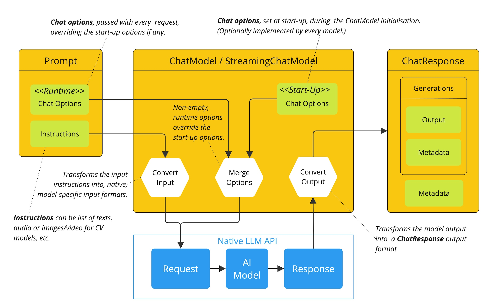
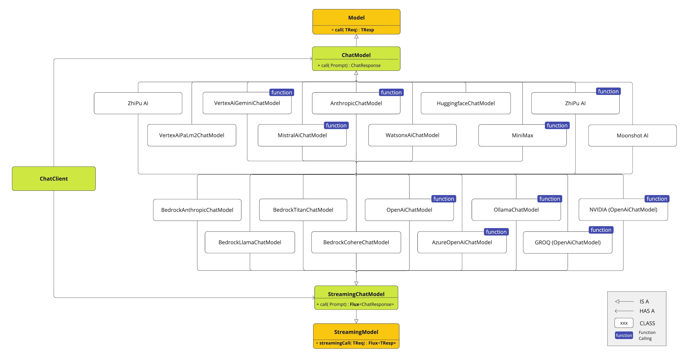

# Read Me First
The following was discovered as part of building this project:

* The original package name 'com.example.ch02-chat-model-api' is invalid and this project uses 'com.example.ch02_chat_model_api' instead.

# Getting Started

### Reference Documentation
For further reference, please consider the following sections:

* [Official Gradle documentation](https://docs.gradle.org)
* [Spring Boot Gradle Plugin Reference Guide](https://docs.spring.io/spring-boot/3.4.11-SNAPSHOT/gradle-plugin)
* [Create an OCI image](https://docs.spring.io/spring-boot/3.4.11-SNAPSHOT/gradle-plugin/packaging-oci-image.html)
* [Spring Web](https://docs.spring.io/spring-boot/3.4.11-SNAPSHOT/reference/web/servlet.html)
* [Spring Reactive Web](https://docs.spring.io/spring-boot/3.4.11-SNAPSHOT/reference/web/reactive.html)
* [Thymeleaf](https://docs.spring.io/spring-boot/3.4.11-SNAPSHOT/reference/web/servlet.html#web.servlet.spring-mvc.template-engines)
* [OpenAI](https://docs.spring.io/spring-ai/reference/api/chat/openai-chat.html)

### Guides
The following guides illustrate how to use some features concretely:

* [Building a RESTful Web Service](https://spring.io/guides/gs/rest-service/)
* [Serving Web Content with Spring MVC](https://spring.io/guides/gs/serving-web-content/)
* [Building REST services with Spring](https://spring.io/guides/tutorials/rest/)
* [Building a Reactive RESTful Web Service](https://spring.io/guides/gs/reactive-rest-service/)
* [Handling Form Submission](https://spring.io/guides/gs/handling-form-submission/)

### Additional Links
These additional references should also help you:

* [Gradle Build Scans – insights for your project's build](https://scans.gradle.com#gradle)

---

### ChatModel API에 대한 설명

 ChatModel이 무엇이고 어떻게 사용하는지, 마치 외국어를 할 줄 아는 친구와 대화하는 것에 비유해서 차근차근 설명해 드릴게요.

1. ChatModel이란? - 똑똑한 AI 비서에게 말을 거는 방법

   - Spring AI: 자바(Java)로 AI를 활용한 애플리케이션을 쉽게 만들 수 있도록 도와주는 스프링(Spring)
     프레임워크의 새로운 프로젝트입니다.
   - `ChatModel`: Spring AI 프로젝트의 핵심 부품으로, ChatGPT, 구글 제미나이(Gemini) 등 다양한 AI 채팅
     모델과 대화할 수 있게 해주는 '표준화된 창구'입니다.

    마치 여러 나라의 AI(미국 AI, 한국 AI, 프랑스 AI)가 있을 때, 우리가 각 나라의 언어를 배울 필요 없이 ChatModel이라는 '만능 통역기'에게 한국어로 말하면, 이 통역기가 각 나라의 AI에게 알아서 전달하고 답변을 받아다 주는 것과 같습니다.

  2. ChatModel과 대화하는 방법 (기본 흐름)
    AI와 대화는 단순히 질문만 던지는 게 아니라, 몇 가지 약속된 형식을 따라야 합니다.

        1. `Prompt` (프롬프트)를 만든다: AI에게 보낼 '요청서'라고 생각하시면 됩니다. 이 요청서에는 그냥 문장만 들어가는 게 아니라, 아래의 '메시지'들이 포함됩니다.

        2. `Prompt` 안에 `Message` (메시지)를 담는다: 대화의 내용을 역할에 따라 구분해서 담습니다.
            - `SystemMessage`: "너는 친절한 여행 전문가야." 와 같이 AI에게 역할을 부여하거나 기본 성격을 정해줍니다.
            - `UserMessage`: "파리 여행 3박 4일 코스 추천해 줘." 와 같이 우리가 AI에게 실제로 물어보는 질문입니다.

        3. `ChatResponse` (응답)를 받는다: Prompt를 ChatModel에게 보내면, AI의 답변이 이 ChatResponse라는 상자에 담겨서 돌아옵니다.

        4. `ChatResponse` 안에서 `Generation` (생성 결과)을 꺼낸다: AI가 생성한 답변 1개를 의미합니다. 이 안에 우리가 원하는 실제 텍스트 답변(AssistantMessage)이 들어있습니다. (예: "네, 파리 3박 4일 코스를 추천해 드릴게요...")

        정리하면 `요청서(Prompt)`를 만들어 `메시지(Message)`를 담아 보내면, `응답(ChatResponse)` 상자를 받고, 그 안에서 진짜 답변(`Generation`)을 꺼내는 과정입니다.

    3. 답변을 받는 두 가지 방식: call vs stream

        ChatModel은 두 가지 방식으로 답변을 받을 수 있습니다.

            - `call()` - 한번에 받기: 질문을 보내고 AI의 답변이 완성될 때까지 기다렸다가 전체 답변을 한 번에 받는 방식입니다. 간단한 질문에 대한 답을 받을 때 유용합니다.
            
            - `stream()` - 실시간으로 받기: 질문을 보내면 AI가 답변을 생성하는 대로 단어 하나, 문장 하나씩 실시간으로 보내줍니다. 마치 ChatGPT 웹사이트에서 타이핑되듯이 글자가 나타나는 것을 구현할 때 사용합니다. 사용자 경험이 훨씬 좋겠죠?

    4. ChatModel을 쓰는 가장 큰 이유: '호환성' 이것이 가장 중요합니다. 개발자는 ChatModel이라는 '만능 통역기' 사용법만 알면 됩니다.

        - 처음에는 OpenAI의 ChatGPT를 쓰다가, 나중에 구글의 제미나이(Gemini)가 더 좋아 보이면?

        - 설정 파일에서 한 줄만 바꾸면 AI 모델을 쉽게 교체할 수 있습니다.
        
        - AI 모델이 바뀌었다고 해서 우리의 서비스 코드를 뜯어고칠 필요가 전혀 없습니다.

        이것이 Spring AI와 ChatModel이 제공하는 가장 강력한 장점입니다.

---

### Chat Model API의 사용 흐름 


'시작(Startup) 옵션'과 '런타임(Runtime) 옵션'을 결합하는 방식은 처음에는 조금 헷갈릴 수 있지만, 자주 가는 단골 카페를 생각하시면 아주 쉽게 이해할 수 있습니다.

커피 주문으로 비유하는 옵션 결합 방식

당신은 매일 아침 스타벅스에 가서 "아이스 아메리카노, 톨 사이즈, 시럽 없이"를 마시는 단골 손님이라고 상상해 보세요.

1. 시작(Startup) 옵션: "늘 마시던 걸로 주세요!" (기본값 설정)

- 설명: '시작 옵션'은 애플리케이션이 처음 시작될 때 AI 모델에 대한 기본 설정을 미리 지정해 두는 것입니다. 마치 카페 바리스타가 당신의 '늘 마시던' 기본 주문을 이미 알고 있는 것과 같습니다.
- 예시: 보통 application.properties 라는 설정 파일에 다음과 같이 저장해 둡니다.

    ```
    # AI 모델은 GPT-4를 기본으로 사용
    spring.ai.openai.chat.options.model=gpt-4
    # AI의 창의성(temperature)은 0.7로 설정
    spring.ai.openai.chat.options.temperature=0.7
    ```

- 장점: 이렇게 해두면, 코드를 짤 때 매번 모델 이름이나 창의성 정도를 지정할 필요 없이 간단하게 AI를 호출할 수 있습니다.

2. 런타임(Runtime) 옵션: "오늘은 특별하게 마실게요!" (요청 시 옵션 변경)

- 설명: '런타임 옵션'은 AI에게 특정 요청을 보낼 때만 일시적으로 기본 설정을 변경하고 싶을 때 사용합니다. 오늘은 유난히 피곤해서 "샷 추가"를 외치거나, 평소와 다른 메뉴를 시키는 것과 같습니다.
- 예시: 자바 코드에서 AI에게 요청서(Prompt)를 만들기 직전에, 이번 요청에만 적용될 특별 옵션을 만듭니다.

    ```
    // "이번 요청은 창의성을 0.2로 낮추고, 답변은 최대 100단어로 제한해줘"
    ChatOptions runtimeOptions = OpenAiChatOptions.builder()
        .withTemperature(0.2f)
        .withMaxTokens(100)
        .build();

    // 이 특별 옵션을 요청서(Prompt)에 담아서 보낸다
    chatModel.call(new Prompt("오늘의 날씨 요약해줘", runtimeOptions));
    ```

- 장점: 기본 설정은 그대로 둔 채, 특정 기능(예: 글 요약, 코드 작성)에만 AI의 행동 방식을 다르게 지정할 수 있어 매우 유연합니다.

3. 결합 방식: "기본 주문에 특별 요청을 반영해주세요!"

이것이 핵심입니다. Spring AI는 당신의 주문을 받을 때 다음과 같이 행동합니다.

1. 먼저, 당신의 기본 주문(시작 옵션)을 확인합니다.
    - 모델: gpt-4, 창의성: 0.7

2. 그다음, 당신의 특별 요청(런타임 옵션)을 확인합니다.
    - 창의성: 0.2, 최대 단어: 100

3. 두 주문을 합치되, 특별 요청을 우선적으로 반영합니다.
    - 모델: 특별 요청에 없었으니 기본값인 gpt-4 유지
    - 창의성: 기본값 0.7이 있었지만, 특별 요청인 `0.2`로 변경 (덮어쓰기)
    - 최대 단어: 기본값에 없었지만, 특별 요청인 100 추가

최종적으로 AI는 `모델: gpt-4`, `창의성: 0.2`, `최대 단어: 100` 이라는 조건으로 이번 요청을 처리하게 됩니다.

---

정리
- 시작(Startup) 옵션: 앱 전체의 '기본 AI 설정' (효율성)
- 런타임(Runtime) 옵션: 특정 요청에만 적용되는 '임시 AI 설정' (유연성)
- 결합: Spring AI가 두 설정을 알아서 합쳐주며, 런타임 옵션이 항상 우선됩니다.


이러한 방식 덕분에 개발자는 평소에는 편리하게 기본값으로 AI를 사용하다가, 필요할 때만 최소한의 코드로 AI의 동작을 세밀하게 제어할 수 있는 것입니다.

---

### ChatResponse 클래스 

ChatResponse는 AI에게 보낸 요청(Prompt)에 대한 'AI의 회신 우편물' 이라고 생각하시면 완벽하게 이해할 수 있습니다.

AI의 회신 우편물: ChatResponse 파헤치기

당신이 AI에게 "스프링 프레임워크가 뭐야?"라는 질문 편지(Prompt)를 보냈다고 상상해 보세요. 잠시 후, AI로부터 답장이 담긴 하나의 '회신 우편물'이 도착합니다. 이 우편물 전체가 바로 ChatResponse입니다.

1. ChatResponse (회신 우편물 전체)

- 이 우편물은 어떤 AI(ChatGPT, 제미나이 등)가 보내든 항상 동일한 표준 규격의 봉투에 담겨 옵니다. 그래서 당신은 내용물을 꺼내는 방법만 알면 됩니다.

- 우편물 겉면에는 '송장(Invoice)' 이 붙어 있습니다. 이것을 `Metadata` (메타데이터) 라고 부릅니다.

    - `Metadata` (송장 정보): 답변 내용 자체는 아니지만, 답변에 대한 중요한 추가 정보가 적혀 있습니다.
    
    - 토큰 사용량: "이 답변을 만드는 데 150 토큰을 사용했습니다." (AI 사용 요금 계산에 필요)
    
    - 안전 등급: "이 콘텐츠는 유해성 검사를 통과했습니다."
    
    - 사용한 모델: "이 답변은 'gpt-4-turbo' 모델이 작성했습니다."

2. Generation (답변 편지지)

- 우편물 봉투(ChatResponse)를 열어보면, 그 안에 AI가 작성한 '답변 편지지' 가 들어있습니다. 이 편지지 한 장이 바로 Generation 입니다.

- 보통은 한 장만 들어있지만, 만약 당신이 AI에게 "시의 제목을 몇 개 추천해줘" 라고 요청했다면, AI는 여러 아이디어를 각각 다른 편지지(Generation)에 적어 여러 장을 보내줄 수도 있습니다.

3. AssistantMessage (AI가 쓴 실제 답변 내용)

- 편지지(Generation)를 펼쳐보면, 드디어 우리가 원하는 AI의 실제 답변 텍스트가 적혀있습니다. 이것이 바로 AssistantMessage 입니다.

- 예: "스프링 프레임워크는 자바 기반의 애플리케이션을 만들기 위한 강력하고 포괄적인 프레임워크입니다."

정리: 

    `ChatResponse`(우편물)를 받아서 열면 `Generation`(편지지)이 나오고, 그 안의 `AssistantMessage`(답변 내용)를 읽는 것입니다!

예제 코드로 살펴보기

아래는 실제 자바 코드에서 ChatResponse를 어떻게 다루는지 보여주는 예시입니다.
    
```
    import org.springframework.ai.chat.ChatResponse;
    import org.springframework.ai.chat.Generation;
    import org.springframework.ai.model.chat.ChatModel;
    import org.springframework.ai.prompt.Prompt;
    import org.springframework.ai.prompt.messages.AssistantMessage;
    
    // ... (ChatModel이 준비되어 있다고 가정)
    
    // 1. AI 모델에게 질문 편지(Prompt)를 보냅니다.
    ChatResponse response = chatModel.call(
        new Prompt("Spring Framework가 뭐야? 한 문장으로 설명해줘.")
    );
    
    // 2. 회신 우편물(ChatResponse)에서 첫 번째 답변 편지지(Generation)를 꺼냅니다.
    //   - getResult()는 가장 대표적인 첫 번째 답변을 편리하게 꺼내주는 기능입니다.
    Generation generation = response.getResult();
    
    // 3. 답변 편지지(Generation)에서 AI의 실제 메시지(AssistantMessage)를 얻습니다.
    AssistantMessage assistantMessage = generation.getOutput();
    
    // 4. 메시지에서 우리가 정말 궁금했던 텍스트 내용을 꺼내 화면에 출력합니다.
    String content = assistantMessage.getContent();
    System.out.println("AI의 답변: " + content);
    // 출력 결과 예시:
    // AI의 답변: Spring Framework는 자바 기반의 애플리케이션을 만들기 위한 강력하고 포괄적인 프레임워크입니다.
    
    // 5. (보너스) 우편물 송장(Metadata)에 적힌 추가 정보도 확인해 봅니다.
    System.out.println("사용한 모델: " + response.getMetadata().getModel());
    System.out.println("토큰 사용량: " + response.getMetadata().getUsage().getTotalTokens());
```

이처럼 ChatResponse는 AI의 답변과 그에 대한 추가 정보를 표준화된 방식으로 담아주기 때문에, 개발자가 어떤 AI 모델을 사용하든 항상 일관된 코드로 결과를 처리할 수 있게 해주는 매우 유용한 클래스입니다.

---
### Generation 클래스란 

Generation 클래스란 AI의 '답변 한 묶음'을 의미합니다.
Generation 클래스를 이해하기 위해, 우리가 AI와 대화하는 상황을 상상해 봅시다.

   1. 나 (사용자): "운동하면 뭐가 좋아? 3가지만 알려줘." (이것을 Prompt 라고 합니다.)
   2. AI: "네, 운동의 이점 3가지는 다음과 같습니다..." (이것이 AI의 '응답'입니다.)

이때 AI가 만들어낸 하나의 완전한 답변 묶음이 바로 Generation 객체에 담깁니다.

AI 모델에 따라서는 하나의 질문에 대해 여러 가지 버전의 답변을 만들어낼 수도 있습니다. 예를 들어,더 긍정적인 답변, 더 전문적인 답변 등 여러 후보를 생성할 수 있죠. 이 경우, 각각의 답변 후보가 별개의 Generation 객체가 됩니다.

정리: 
Generation은 AI가 생성한 하나의 답변 단위라고 생각하시면 가장 쉽습니다.

---

Generation은 무엇을 담고 있나요?

Generation 객체 안에는 크게 두 가지 정보가 들어있습니다.

   1. AI의 실제 답변 내용 (AssistantMessage): AI가 생성한 텍스트 메시지 그 자체입니다. 우리가 실제로 보게 되는 AI의 답변이죠.
   2. 메타데이터 (Metadata): 답변 내용 외의 추가 정보입니다. 예를 들면 다음과 같습니다.
       * 이 답변을 생성하는 데 문제가 없었는지 (e.g., finishReason)
       * 저작권이나 유해성 등 안전과 관련된 정보
       * (모델에 따라) 이 답변에 대한 신뢰도 점수 등


---
 AssistantMessage 클래스에 대해서도 가장 이해하기 쉽게 설명해 드릴게요.

  AssistantMessage 클래스, 'AI의 역할'로 보내는 메시지

  AssistantMessage를 이해하려면, AI와 대화할 때 여러 '역할'이 있다는 것을 먼저 알면 좋습니다.
  Spring AI는 대화 속 역할을 크게 3가지로 나눕니다.

   1. `UserMessage`: 사용자가 AI에게 보내는 메시지 (우리의 질문)
   2. `AssistantMessage`: AI(어시스턴트)가 사용자에게 보내는 메시지 (AI의 답변)
   3. `SystemMessage`: 대화의 규칙이나 AI의 역할을 정해주는 시스템 메시지 (예: "너는 지금부터 친절한
      여행 가이드야.")

  이 중에서 AssistantMessage는 이름 그대로 AI, 즉 '어시스턴트'의 답변을 담는 전용 클래스입니다.

---

### AssistantMessage 글래스란

  Generation과 AssistantMessage의 관계

  앞에서 Generation이 'AI의 답변 한 묶음'이라고 설명드렸죠? AssistantMessage는 바로 그 묶음 안에
  들어있는 실제 내용물입니다.

  비유를 들어볼게요.

   * 택배 상자(ChatResponse)가 도착했습니다.
   * 상자를 열어보니 상품(Generation)이 들어있습니다.
   * 상품의 포장을 뜯으니 우리가 주문한 실제 물건(`AssistantMessage`)이 나옵니다.

  즉, Generation은 '답변'이라는 이벤트 자체를 포장하는 역할이며, 그 안에는 'AI의 답변 내용'인
  AssistantMessage가 들어있는 구조입니다.

  왜 그냥 텍스트(String)가 아닐까요?

  그냥 텍스트로 답변을 주고받을 수도 있지만, AssistantMessage라는 객체로 감싸면 다음과 같은 장점이
  있습니다.

   * 명확한 역할 구분: 이 메시지가 사용자의 말인지, AI의 답변인지 명확하게 구분할 수 있습니다. 나중에
     대화 기록을 관리하거나 분석할 때 매우 유용합니다.
   * 확장성: 지금은 텍스트 내용만 있지만, 나중에 AI가 이미지나 다른 형태의 콘텐츠를 답변에 포함하게
     될 경우, AssistantMessage 클래스를 확장하여 쉽게 처리할 수 있습니다.
---

### LLM 제공 업체별 구현 클래스 
아래는 그림은 ChatModel 인터페이스를 구현한 클래스 다어어그램입니다




###  ch02-chat-model-api 프로젝트 생성 절차

1. 단계 

    ch01-spring-ai-project의 폴더를 복사하여 ch02-chat-model-api로 붙여넣는다 


2. 단계
    settings.gradle 파일 아래와 같이 수정 
```    
     rootProject.name = 'ch02-chat-model-api'
```

3. 단계 
    main/resources/cpplication.properties 파일 아래와 같이 수정 
```
spring.application.name=ch02-chat-model-api
...

```

4. 단계 
    com.example.demo.HomeController 클래스를 패키지 명을  com.example.demo.controller.HomeController 로 변경합니다 


5. AiService 클래스
  AI와 대화하는 '전문 비서' 역활 을 하는 클래스입니다

  이 AiService 클래스는 우리 애플리케이션과 실제 AI 모델(예: ChatGPT) 사이에서 의사소통을
  전문적으로 처리하는 비서라고 생각하시면 쉽습니다.

  우리가 그냥 "이것 좀 물어봐 줘" 하고 질문을 던지면, 이 비서(AiService)가 다음과 같은 일을
  순서대로 처리해 줍니다.

   1. AI가 잘 알아들을 수 있도록 질문을 예쁘게 포장하고,
   2. AI에게 추가적인 요청사항(예: "답변은 꼭 한국어로 해줘")을 덧붙여서,
   3. AI 모델에게 질문을 전달한 뒤,
   4. AI가 답변을 주면, 우리가 쓰기 편한 형태로 가공해서 최종 결과만 돌려주는 역할입니다.

  코드 상단의 @Service 어노테이션은 "이 클래스는 우리 애플리케이션에서 중요한 전문 비서 역할을 하니
  잘 관리해 줘!" 라고 스프링 프레임워크에게 알려주는 표시입니다.

  ---

  AiService의 두 가지 대화 방식

  이 비서(AiService)는 AI와 대화하는 두 가지 방식을 가지고 있습니다.

   1. generateText(): 답변 전체를 한 번에 받기 (AI가 답변을 다 쓸 때까지 기다렸다가 통째로 가져오는
      **동기화** 방식)
   2. generateStreamText(): 답변을 실시 채팅 같은 기능으로 받기 (AI가 글자를 쓰는 대로 한 글자씩 바로바로 전달받는 방식, ChatGPT 웹사이트처럼 **비동기** 방식)

---
### AiController 클래스 수정 

---
### html에서 ajax로 스트리밍 테이터 얻는 방법 
```
        //스트리밍 응답 처리
    // responseBody는 서버가 보낸 응답의 내용물이 담겨있는 '파이프(ReadableStream)'입니다.
    // .getReader()는 이 파이프에서 데이터를 조금씩 꺼내 읽을 수 있는 '수도꼭지' 역할을 하는 reader 객체를 가져옵니다.
    const reader = responseBody.getReader();
    // 서버가 보낸 데이터는 원래 컴퓨터만 알아볼 수 있는 숫자들의 배열(바이트 데이터)입니다.
    // TextDecoder는 이 숫자 배열을 우리가 읽을 수 있는 'utf-8' 형식의 글자(텍스트)로 변환해주는 '번역기'입니다.
    const decoder = new TextDecoder("utf-8");
    let content = "";
    while (true) {
        // '수도꼭지'를 틀어 파이프에서 데이터 한 조각(chunk)이 나올 때까지 기다립니다.
        // 데이터 조각이 나오면 { value, done } 이라는 객체를 반환합니다.
        // value: 읽어온 데이터 조각 (아직은 글자가 아닌 숫자 배열).
        // done: 데이터 파이프가 완전히 비어서 더 이상 읽을 내용이 없으면 true가 되고, 아직 남아있으면 false가 됩니다.
        const { value, done } = await reader.read();

        if (done) break;
        // '번역기'를 사용해 숫자 배열(value)을 우리가 읽을 수 있는 텍스트 조각(chunk)으로 변환합니다.
        let chunk = decoder.decode(value);
        content += chunk;
    }
    console.log(content);

```

### 사용자 질문과 AI 응답을 보여줄 엘리먼트 UI를 home.html에 추가하여 볼 수 있게 기능 추가함 
- 다음에 사용자 질문과 AI 응답을 보여줄 엘리먼트 UI을 javasscript  변경함 
- 현재 ai에게 질문을 할 때 제출 버튼을 클릭하면 처리중인지 아닌지 확인 할 수 없어 다음에 진행중임을 표시하는 함수 구현 할 예정임  

### ai에게 질문시 진행중임을 표시하는 기능 구현 
- 현재 ai에게 질문을 많이 하면 질문과 응답이 자동으로 최단으로 이동되지 않습니다.
- 다음에는 질문과 응답이 추가되고 채팅 패널을 최하단으로 자동 이동되게 구현 할 예정임  

### 질문과 응답이 추가되고 채팅 패널을 최하단으로 자동 이동
- 현재까지는 서버에 ChatModel의 기능을 동기화 함수인 call()를 사용하여 구현한 예제입니다 
- 다음은 비동기 스트리임 응답에 대하여 알아볼 예정임 

### ChatModel 비동기 응답 처리
AiController.java 
```
  @PostMapping(
    value = "/chat-model-stream",
    consumes = MediaType.APPLICATION_FORM_URLENCODED_VALUE,
    produces = MediaType.APPLICATION_NDJSON_VALUE //라인으로 구분된 청크 텍스트
  )
  public Flux<String> chatModelStream(@RequestParam("question") String question) {
    Flux<String> answerStreamText = aiService.generateStreamText(question);
    return answerStreamText;
  }

```

HomeController.java 파일에 /chat-model, /chat-model-stream  URL 추가합니다 
```
    @GetMapping("/chat-model")
    public String chatModel() {
        return "chat-model";
    }

    @GetMapping("/chat-model-stream")
    public String chatModelStream() {
        return "chat-model-stream";
    }

```

home.html 파일을 복사하여 chat-model-stream.html, chat-model.html 파일을 생성합니다 
TEMPLATES
├─  chat-model-stream.html
├─  chat-model.html
└─  home.html

home.html은 1장에 있는 내용으로 변경합니다 
chat-model.html은 조금전에 진행한  chat-model 동기화 처리에 대한 예제로 변경합니다 
chat-model-stream.html은 비동기화 처리에 대한 예제로 변경합니다 

### springai.js에 스트리밍 텍스트 응답을 출력하는 함수 구현 
```
// ##### 스트리밍 텍스트 응답을 출력하는 함수 #####
springai.printAnswerStreamText = async function (responseBody, targetId, chatPanelId) {
    const targetElement = document.getElementById(targetId);
    const reader = responseBody.getReader();
    const decoder = new TextDecoder("utf-8");
    let content = "";
    while (true) {
        const { value, done } = await reader.read();
        if (done) break;
        let chunk = decoder.decode(value);
        content += chunk;
        const targetElement = document.getElementById(targetId);
        targetElement.innerHTML = content;
        springai.scrollToHeight(chatPanelId);
    }
};

```

### springai.js에 스트리밍 텍스트 응답을 출력하는 함수 구현 
