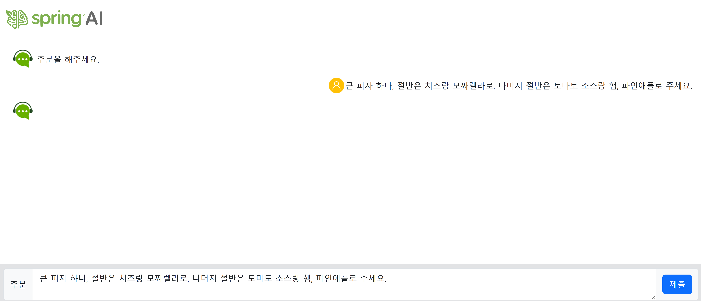

# Getting Started

## 사전 작업 순서 

1. ch01-spring-ai-project 프로젝트를 복사하여 ch03-prompt로 붙여넣는다.

2. chunk 관련 기능은 삭제합니다 
```
src 폴더에 있는 chunk 폴더를 삭제합니다 
resources/templates/chunk 폴더를 삭제합니다 
```
3. src/main/resources/applications.properties 파일을 아래와 같이 수정합니다 
```
#spring.application.name=ch01-spring-ai-project
spring.application.name=ch03-prompt

...

```

4. settings.gradle 아래와 같이 수정합니다 
```
rootProject.name = 'ch03-prompt'
```

5. HelloController.java 파일을 HomeController.java로 변경합니다

6. HomeController.java 파일을 아래와 같이 수정합니다 
```
package com.example.demo.controller;

import org.springframework.stereotype.Controller;
import org.springframework.web.bind.annotation.GetMapping;

@Controller
public class HomeController {

    @GetMapping("/")
    public String home() {
        return "home";
    }

    // 이 URL은 prompt-template 실행을 위한 엔드포인트입니다
    @GetMapping("/prompt-template")
    public String promptTemplate() {
        return "prompt-template";
    }  

}

```

7. resources/templates/home.html 파일 아래와 같이 수정합니다 
```
<!DOCTYPE html>
<html>

<head>
  <meta charset="UTF-8" />
  <meta name="viewport" content="width=device-width, initial-scale=1.0" />
  <title>Spring AI</title>
  <link href="https://cdn.jsdelivr.net/npm/bootstrap@5.3.5/dist/css/bootstrap.min.css" rel="stylesheet" />
  <script src="https://cdn.jsdelivr.net/npm/bootstrap@5.3.5/dist/js/bootstrap.bundle.min.js"></script>
</head>

<body>
	<div class="d-flex flex-column vh-100">
	  <div id="headPanel" class="navbar justify-content-between">
	    <a href="/" class="navbar-brand ps-2">
	      
	    </a>>
	  </div>	
	
	  <div class="card m-2">
			<div class="card-header">
				Ch03. 프롬프트 엔지니어링
			</div>
			<div class="card-body">
				<a href="/prompt-template" class="btn btn-info btn-sm m-1">prompt-template</a>
			</div>
	  </div>
	</div>
</body>

</html>
```

8. resources/templates/prompt-template.html 파일 아래와 같이 수정합니다
   - ch01에서 진행한 home.html 파일을 prompt-template.html으로 복사합니다 
   

9. 위 작업이 완료된 것은 git 이력은 [3장 작업을 시작하기 위해 초기설정]을 checkout하여 작업은 진행하시면 됩니다 

10. 실행 하여 테스트 해봅니다 

    브라우저 주소창에 http://localhost:8080/을 실행하면 아래 그림과 같이 출력됩니다 

    

    prmopt template 버튼을 클릭하면 아래와 같이 실행되는 것을 확인 할 수 있습니다 

    

---

## PromptTemplate 클래스란 

PromptTemplate: 재사용 가능한 'AI 질문 양식'

PromptTemplate을 한마디로 정의하면, 자주 사용하는 AI 질문의 '틀' 또는 '양식(Template)'이라고 할 수 있습니다.

  가장 쉬운 예로, 우리가 흔히 쓰는 '메일 양식'을 생각해 보세요.

> 제목: {고객명}님, 문의하신 내용에 대한 답변입니다.

>

> 안녕하세요, {고객명}님.

> 문의하신 {문의주제} 건에 대해 답변드립니다.

> ...

> 담당자: {담당자명} 드림


  이 메일 양식만 있으면, 우리는 {고객명}, {문의주제}, {담당자명} 부분만 계속 바꿔가면서 수많은 고객에게 메일을 보낼 수 있습니다. 매번 똑같은 문장을 처음부터 끝까지 작성할 필요가 없죠.

  PromptTemplate이 바로 이런 역할을 합니다. AI에게 보낼 프롬프트(요청문)의 고정된 부분은 '틀'로 만들어두고, 계속 바뀌는 부분은 `{변수}` 형태의 '빈칸'으로 남겨두는 것입니다.

  ---

  왜 PromptTemplate을 사용할까요?

  AI에게 비슷한 패턴의 질문을 반복적으로 해야 할 때, PromptTemplate을 사용하면 다음과 같은 엄청난 장점이 있습니다.

   * 재사용성: 똑같은 프롬프트 구조를 계속 재사용할 수 있어 코드 중복이 사라집니다.
   * 가독성: 프롬프트의 전체 구조와 그 안에서 어떤 부분이 동적으로 바뀌는지 한눈에 파악하기 쉽습니다.
   * 유지보수: 나중에 프롬프트의 문구를 수정해야 할 때, 양식(Template) 한 군데만 고치면 되므로 유지보수가 매우 편리해집니다.

  ---

  가장 직관적인 예제: 'N행시 짓기' AI

  AI에게 특정 주제로 N행시를 짓게 하는 기능을 만든다고 상상해 봅시다. 이때 AI에게 보내는 요청은 항상 비슷한 구조를 가질 겁니다.

  > "너는 N행시의 대가야. {주제} 라는 단어로 {행수}행시를 지어줘."

  이 구조를 PromptTemplate으로 만들어 보겠습니다.

1단계: '질문 양식' 만들기

먼저, 바뀌는 부분인 {주제}와 {행수}를 빈칸으로 둔 '질문 양식'(PromptTemplate)을 만듭니다.

```
import org.springframework.ai.chat.prompt.PromptTemplate;
import java.util.Map;

// 1. {주제}와 {행수}를 빈칸으로 둔 프롬프트 '양식'을 정의합니다.
String templateText = "너는 N행시의 대가야. '{topic}' 이라는 단어로 '{lines}'행시를 지어줘.";
PromptTemplate promptTemplate = new PromptTemplate(templateText);
```
2단계: '빈칸'에 채워 넣을 내용 준비하기

이제 {topic}과 {lines}라는 빈칸에 들어갈 실제 값들을 Map이라는 데이터 구조에 담아 준비합니다.
```
// 2. 'topic' 빈칸에는 "스프링"을, 'lines' 빈칸에는 "2"를 채워 넣을 준비를 합니다.
Map<String, Object> variables = Map.of(
     "topic", "스프링",
     "lines", 2
 );
```   
  중요: Map의 key("topic", "lines")는 양식에 있던 {**빈칸**}의 **이름**과 **정확히 일치**해야 합니다.

  3단계: 양식에 내용을 채워 '완성된 질문' 만들기

  준비된 양식(promptTemplate)과 내용물(variables)을 합쳐서 AI에게 보낼 최종 '완성된 질문'(Prompt)을
  만듭니다. 이 과정을 '렌더링(rendering)'이라고 합니다.
```
// 3. 양식(template)에 내용(variables)을 채워서 최종 프롬프트 객체를 생성합니다.
Prompt finalPrompt = promptTemplate.create(variables);
```

4단계: 결과 확인

finalPrompt 안에는 어떤 내용이 들어있을까요? create 메소드가 {topic}과 {lines}를 우리가 준비한 값으로 모두 바꿔치기해서 다음과 같은 완성된 질문을 만들어 줍니다.

```
// finalPrompt.getContents() 를 출력해보면 나오는 최종 질문 내용
```
"너는 N행시의 대가야. '스프링' 이라는 단어로 '2'행시를 지어줘."

이제 이 finalPrompt를 ChatClient나 ChatModel에 넘겨주기만 하면 AI가 2행시를 지어주겠죠!

재사용성의 마법:

만약 3행시를 짓고 싶다면? 양식을 또 만들 필요 없이, 내용물만 바꿔서 재사용하면 됩니다.
```
// 내용물만 바꿔서 양식을 재사용!
Map<String, Object> variables2 = Map.of(
    "topic", "인공지능",
    "lines", 3
);

// 똑같은 promptTemplate을 사용해서 새로운 프롬프트를 생성
Prompt finalPrompt2 = promptTemplate.create(variables2);

// 결과: "너는 N행시의 대가야. '인공지능' 이라는 단어로 '3'행시를 지어줘."
```

핵심 정리:

PromptTemplate은 반복되는 AI 요청문을 '양식'으로 만들어두고, 그 안의 '빈칸'만 바꿔 끼워가며 효율적으로 프롬프트를 생성하게 해주는 매우 유용한 도구입니다.

---

### 왜 SystemPromptTemplate을 사용할까요?

AI에게 역할을 부여하는 '시스템 프롬프트'와 사용자의 '질문 프롬프트'를 분리하면 다음과 같은 장점이 있습니다.

* 역할과 질문의 분리: AI의 정체성(예: "너는 번역가야")과 사용자의 질문("이것을 번역해 줘")을 명확히 나눌 수 있어 코드가 깔끔해집니다.

* 동적인 역할 부여: 시스템 프롬프트 자체도 템플릿으로 만들면, AI의 역할을 동적으로 계속 바꿀 수 있습니다. (예: {언어} 번역가, {직업} 전문가)

---

### 시나리오: '다국어 번역기' AI 만들기

이번에는 AI를 '지정한 언어로 번역해 주는 번역기'로 만드는 시나리오를 사용하겠습니다.

   * 시스템 프롬프트 양식: "답변을 생성할 때 HTML와 CSS를 사용해서 파란 글자로 출력하세요.<span> 태그 안에 들어갈 내용만 출력하세요."
   * 사용자 프롬프트 양식: "다음 한국어 문장을 {language}로 번역해주세요.\n 문장: {statement}"

이제 이 두 가지 템플릿을 조합하는 3가지 방법을 살펴보겠습니다.

템플릿을 사용하는 방법

    1. 가장 기본적인 수동 방식 (각각의 메시지를 생성 후 조합)
    2. PromptTemplat.createMessage() 메소드를 프롬프트를 생성방법을 확인
    3. ChatClient의 prompt(), messages() 메소드를 사용하는 방법  
    4. ChatClient와 함께 사용하는 세련된 방식 (.system()과 .user() 활용)

---
### 1. PromptTemplate을 사용하기 위한 서비스 클래스 구조 
```
@Service
@Slf4j
public class AiServicePromptTemplate {
  // ##### 필드 #####
  private ChatClient chatClient;
  
  // 1. 시스템 프롬프트 템플릿을 정의합니다.
  private PromptTemplate systemTemplate = SystemPromptTemplate.builder()
      .template("""
          답변을 생성할 때 HTML와 CSS를 사용해서 파란 글자로 출력하세요.
          <span> 태그 안에 들어갈 내용만 출력하세요.
          """)
      .build();  

  // 2. 사용자 프롬프트 템플릿을 정의합니다.  
  private PromptTemplate userTemplate = PromptTemplate.builder()
      .template("다음 한국어 문장을 {language}로 번역해주세요.\n 문장: {statement}")
      .build();

  // ##### 생성자 #####
  public AiServicePromptTemplate(ChatClient.Builder chatClientBuilder) {
    chatClient = chatClientBuilder.build();
  }
}
```

### 1. 가장 기본적인 수동 방식 (각각의 메시지를 생성 후 조합)
PromptTemplate.create()을 사용하여 프롬프트를 생성합니다.
```
  // ##### 메소드 #####
  public Flux<String> promptTemplate1(String statement, String language) {    
    
    //PrompTemplate(userPrompt)로 prompt를 생성합니다.
    //생성시 바인딩 데이터로 statement, language를 전달합니다   
    Prompt prompt = userTemplate.create(
        Map.of("statement", statement, "language", language));

    //ChatClient의 prompt() 메소드를 호출할 때 prompt 매개값을 전달하였습니다. 
    //실제로 내부적으로 전달되는 것은 userTemplate 입니다 
    Flux<String> response = chatClient.prompt(prompt)
        .stream()
        .content();

    return response;
  }
```

위 방법은 간단하게 userTemplate만 사용하여 LLM을 호출하는 경우에 사용하면 좋습니다


---
### AiControllerPromptTemplate 클래스에서 AiServicePromptTemplate 서비스에서 사용
```
package com.example.demo.controller;

import org.springframework.web.bind.annotation.RequestMapping;
import org.springframework.web.bind.annotation.RequestParam;
import org.springframework.web.bind.annotation.RestController;

import com.example.demo.service.AiServicePromptTemplate;

import lombok.extern.slf4j.Slf4j;
import reactor.core.publisher.Flux;

import org.springframework.beans.factory.annotation.Autowired;
import org.springframework.http.MediaType;
import org.springframework.web.bind.annotation.PostMapping;

@RestController
@RequestMapping("/ai")
@Slf4j
public class AiControllerPromptTemplate {

    // ##### 필드 #####
    @Autowired
    private AiServicePromptTemplate aiService;

    // ##### 요청 매핑 메소드 #####
    @PostMapping(value = "/prompt-template", 
    consumes = MediaType.APPLICATION_FORM_URLENCODED_VALUE,
    produces = MediaType.APPLICATION_NDJSON_VALUE)
    public Flux<String> promptTemplate(
        @RequestParam("statement") String statement,
        @RequestParam("language") String language
        ) {
        return aiService.promptTemplate1(statement, language);
    }
    
}

```
---

### prompt-template.html에 언어 선택UI와 /prompt-template 엔드포인트를 호출 할 수 있게 수정함 
언어 선택UI 추가 
```
...
    <div id="inputPanel" class="bg-secondary-subtle">
      <!-- 언어 선택 시작 -->
      <div class="input-group p-2">
        <span class="input-group-text">언어</span>
        <select id="language" class="form-control">
          <option value="독일어">독일어</option>
          <option value="중국어">중국어</option>
          <option value="일본어">일본어</option>
          <option value="영어" selected>영어</option>
        </select>
      </div>
      <!-- 언어 선택 끝 -->
      <!-- 질문 입력 패널 시작 -->
      <div class="input-group p-2">
        <span class="input-group-text">질문</span>
...
```

/prompt-template 엔드포인트를 호출할 수 있게 수정
```
...
      try {
        // 텍스트 질문을 얻고 대화 패널에 추가하기
        const question = document.getElementById("question").value;
        if (question === "") return;
        springai.addUserQuestion(question, "chatPanel");

        // 응답이 오기까지 스피너 보여주기
        springai.setSpinner("spinner", true);

        // AJAX 요청하고 응답받기
        const language = document.getElementById("language").value;
        const response = await fetch('/ai/prompt-template', {
          method: "post",
					headers: {
						'Content-Type': 'application/x-www-form-urlencoded',
						'Accept': 'application/x-ndjson' //라인으로 구분된 청크 데이터
					},					
          body: new URLSearchParams({ "statement":question, language })
        });
        // AI 모델 답변이 들어갈 위치를 대화 패널에 추가
        const uuid = springai.addAnswerPlaceHolder("chatPanel");
        
        // 텍스트 답변 출력하기
        springai.printAnswerStreamText(response.body, uuid, "chatPanel");

      } catch (error) {
        console.log(error);
      } finally {
        //스피너 숨기기
        springai.setSpinner("spinner", false);
      }
...
```
---
### 브라우저에서 실행 하여 테스트 해보기 

    브라우저 주소창에 http://localhost:8080/prompt-template을 실행하고 언어를 변경 하고 제출을 하면 아래 그림과 같이 출력됩니다 

    

---
### PromptTemplat.createMessage() 메소드를 사용하여 프롬프트를 생성방법을 확인 
```
// ##### 메소드 #####
public Flux<String> promptTemplate2(String statement, String language) {    
  // 1. 각 템플릿의 빈칸을 채울 값들을 Map으로 준비합니다.
  Map<String, Object> userVariables = Map.of("statement", statement, "language", language);

  // 2. 각 템플릿을 Message 객체로 렌더링합니다.
  //    주의: .create()가 아닌 .createMessage()를 사용해야 Message 타입으로 반환됩니다.
  Message systemMessage = systemTemplate.createMessage();
  Message userMessage = userTemplate.createMessage(userVariables);

  // 3. 생성된 메시지들을 리스트에 담아 최종 Prompt 객체를 만듭니다.
  Prompt prompt = new Prompt(List.of(systemMessage, userMessage));

  // 4. 완성된 Prompt를 ChatClient에 전달하여 AI를 호출합니다.
  Flux<String> response = chatClient.prompt(prompt)
      .stream()
      .content();

  return response;
}          
```
---
### 3. ChatClient클래스의 prompt(), messages() 메소드를 사용하여 프롬프트 생성 방법
```
  // ChatClient.prompt() 메소드, messages() 메소드를 사용하여 프롬프트 템플릿 객체를 전달하여 프롬프트를 생성합는 방법입니다 
  
  public Flux<String> promptTemplate3(String statement, String language) {    
    Flux<String> response = chatClient.prompt()
        .messages(
            systemTemplate.createMessage(),
            userTemplate.createMessage(Map.of("statement", statement, "language", language)))
        .stream()
        .content();
    return response;
  }  

```
---
### 4. ChatClient와 함께 사용하는 세련된 방식 (.system()과 .user() 활용)
```
  public Flux<String> promptTemplate4(String statement, String language) {    
    Flux<String> response = chatClient.prompt()
        .system(systemTemplate.render())
        .user(userTemplate.render(Map.of("statement", statement, "language", language)))
        .stream()
        .content();
    return response;
  }   
```
---
### 5. String.formatted() 메소드를 사용하여 프롬프트를 생성합니다.
```
    public Flux<String> promptTemplate5(String statement, String language) {    
        String systemText = """
            답변을 생성할 때 HTML와 CSS를 사용해서 파란 글자로 출력하세요.
            <span> 태그 안에 들어갈 내용만 출력하세요.
            """;
        String userText = """
            다음 한국어 문장을 %s로 번역해주세요.\n 문장: %s
            """.formatted(language, statement);
        
        Flux<String> response = chatClient.prompt()
            .system(systemText)
            .user(userText)
            .stream()
            .content();
        return response;
    }     

```
---
## 3.2 복수 메시지 추가 
- LLM에 요청할 때 하나의 SystemMessage와 하나의 UserMessage만 프로프트에 포함되는 것은 아님 
- 한개의 SystemMessage와 여러 개의 UserMessage, 여러 개의 AssistantMessage도 같이 포함될 수 있음 
- 대표적인 예로 대화 기록을 유지 하기, 이전 대화 내용(UserMessage + AssistantMessage) 전체를 프롬트드에 포함 시킬 수 있음 

### serivce/AiServiceMultiMessage.java 
기능 설명 

1. 시스템 메시지(System Message) 생성
  * SystemMessage는 AI 모델에게 역할을 부여하거나 행동 지침을 내리는 특별한 메시지입니다.
  * 여기서는 "당신은 AI 비서입니다. 지난 대화 내용을 참고해서 답변해주세요." 라는 지침을 설정하여, AI가 단순히 질문에만 답하는 게 아니라 이전 대화의 문맥을 파악하여 답변하도록 유도합니다.

2. 대화 초기화
  * if(chatMemory.size() == 0): chatMemory 리스트의 크기가 0이라는 것은 대화가 막 시작되었음을 의미합니다.
  * 이때만 SystemMessage를 chatMemory에 추가합니다. 이렇게 하면 전체 대화 세션 동안 AI는 설정된 역할을 유지하게 됩니다.

3. LLM 요청 및 응답 (Spring AI `ChatClient` 사용)
  * chatClient.prompt(): LLM에 보낼 프롬프트(요청)를 구성하기 시작합니다.
  * .messages(chatMemory): 가장 중요한 부분입니다. chatMemory에 저장된 이전 대화 기록 전체(SystemMessage 포함)를 요청에 추가합니다.
  * .user(question): 그 뒤에 현재 사용자의 질문을 추가합니다.
  * 결과적으로 [시스템 메시지, 이전 사용자 질문1, 이전 AI 답변1, 이전 사용자 질문2, ..., 현재 사용자 질문] 형태의 대화 목록이 LLM에 전달됩니다.
  * .call().chatResponse(): 구성된 프롬프트를 LLM에 보내고, 응답이 올 때까지 기다린 후(call()), 전체 메타데이터를 포함한 ChatResponse 객체로 응답을 받습니다.

4. 대화 기록 업데이트 (상태 관리)
* LLM으로부터 답변을 받은 후, 방금 사용자가 질문한 내용(UserMessage)과 AI가 답변한 내용(AssistantMessage)을 chatMemory 리스트에 추가합니다.
* 이렇게 chatMemory를 계속 업데이트해야 다음번 질문을 할 때 방금 나눈 대화까지 포함하여 문맥을 유지할 수 있습니다. 이 chatMemory 객체는 컨트롤러 계층에서 세션 등을 통해 관리 해야 합니다 

5. 결과 반환
  * chatResponse에서 AI의 답변에 해당하는 AssistantMessage를 꺼내고, 그 안에서 실제 텍스트 내용(getText())을 추출하여 반환합니다. 이 문자열이 사용자에게 보여질 최종 답변이 됩니다.

요약 및 핵심 포인트

* 상태 유지(Stateful) 대화: 이 서비스는 chatMemory라는 List를 통해 이전 대화 기록을 계속 유지하고 다음 요청에 활용함으로써, 단발성 질의응답이 아닌 연속적인 대화를 가능하게 합니다.
* 역할 기반 프롬프팅: SystemMessage를 이용해 AI 모델의 페르소나(AI 비서)와 행동 방식을 지정하여 더 일관되고 원하는 방향의 답변을 얻습니다.
* Spring AI 추상화: 복잡한 API 호출 과정을 ChatClient라는 객체와 .prompt()...call()과 같은 직관적인 메소드 체이닝으로 매우 간단하게 처리하고 있습니다. 개발자는 HTTP 요청/응답이나 JSON 파싱에 신경 쓸 필요가 없습니다.

**동기 방식**으로 구현한 이유는 로직을 간단하고 쉽게 이해 할 수 있게 하기 위해서 입니다.

---
### controller/AiControllerMultiMessage.java
이 클래스는 사용자의 웹 요청을 받아 AiServiceMultiMessages 서비스와 연결해주는 스프링
컨트롤러(Controller) 입니다. 이 컨트롤러의 가장 중요한 역할은 HTTP 세션(Session)을 이용해
사용자별 대화 기록을 관리하는 것입니다.

``` java
@RestController
@RequestMapping("/ai")
@Slf4j
public class AiControllerMultiMessages {
  // ##### 필드 ##### 
  @Autowired
  private AiServiceMultiMessages aiService;
  
  // ##### 요청 매핑 메소드 #####
  @PostMapping(
    value = "/multi-messages",
    consumes = MediaType.APPLICATION_FORM_URLENCODED_VALUE,
    produces = MediaType.TEXT_PLAIN_VALUE
  )
  public String multiMessages(
      @RequestParam("question") String question, HttpSession session) {
    
    // 1. 세션에서 대화 기록 가져오기
    List<Message> chatMemory = (List<Message>) session.getAttribute("chatMemory");
    // 2. 대화 기록이 없으면 새로 생성
    if(chatMemory == null) {
      chatMemory = new ArrayList<Message>();
      session.setAttribute("chatMemory", chatMemory);
    }
    // 3. 서비스 호출하여 답변 받기
    String answer = aiService.multiMessages(question, chatMemory);
    
    // 4. 답변 반환  }
}

```

---
## 3.3 디폴트 메시지와 옵션 

디폴트 메시지와 옵션은 ChatClient 인스턴스를 생성할 때, 해당 클라이언트를 통해 나가는 모든 요청에 일관된 규칙과 설정을 적용하기 위해 사용됩니다. ChatClient를 생성할 때 디폴트 메시지와 옵션을 설정하면, LLM을 요청할 때 생략(메시지, 옵션)할 수 있습니다.


|메소드|설명|
|---|---|
|defaultSystem()| 기본 SystemMessage를 추가 |
|defaultUser()| 기본 UserMessage를 추가 |
|defaultOptions()| 기본 대화옵션을 설정|

 시나리오: "긍정 에너지 뿜뿜! 챗봇" 만들기

  우리가 만들고 싶은 챗봇의 규칙은 다음과 같다고 가정해 봅시다.

   1. 페르소나(Persona): 적절한 감탄사, 웃음등을 넣어서 친절하게 대화를 해주세요..
   2. 언어: 모든 답변은 반드시 한국어로 해야 한다.
   3. 창의성: 약간 창의적이고 다양한 답변을 생성해야 한다. (너무 딱딱하지 않게)
   4. 토큰 : 너무 긴 답변을 하지 않도록 최대토큰 수를 300으로 설정한다
   5. 모델: 비용 절약을 위해 gpt-3.5-turbo 모델을 사용한다.

  이 규칙들을 모든 AI 요청마다 반복해서 설정하는 것은 번거롭고 실수의 여지가 있습니다. 이때 디폴트 메시지와 옵션을 사용하면 이 규칙들을 단 한 번만 설정할 수 있습니다.

service/AiServiceDefaultMethod.java 

```java

@Service
@Slf4j
public class AiServiceDefaultMethod {
  // ##### 필드 #####
  private ChatClient chatClient;

  // ##### 생성자 #####
  public AiServiceDefaultMethod(ChatClient.Builder chatClientBuilder) {
    chatClient = chatClientBuilder
        .defaultSystem("""
          적절한 감탄사, 웃음등을 넣어서 친절하게 대화를 해주세요.
          모든 답변은 반드시 한국어로 해야 합니다.
          """)
        .defaultOptions(ChatOptions.builder()
            .temperature(1.0)
            .maxTokens(300)
            .model("gpt-3.5-turbo")
            .build())
        .build();
  }

  // ##### 메소드 #####
  public Flux<String> defaultMethod(String question) {   
    Flux<String> response = chatClient.prompt()
        .user(question)
        .stream()
        .content();
    return response;
  }
}
```

controller/AiControllerDefaultMethod.java 
```java

@RestController
@RequestMapping("/ai")
@Slf4j
public class AiControllerDefaultMethod {
  // ##### 필드 ##### 
  @Autowired
  private AiServiceDefaultMethod aiService;
  
  // ##### 메소드 #####
  @PostMapping(
    value = "/default-method",
    consumes = MediaType.APPLICATION_FORM_URLENCODED_VALUE,
    produces = MediaType.APPLICATION_NDJSON_VALUE
  )
  public Flux<String> defaultMethod(@RequestParam("question") String question) {
    return aiService.defaultMethod(question);
  }
}

```

브라우저에서 실행 하여 테스트 해보기
http://localhost:8080/default-method을 실행하고 제출을 하면 아래 그림과 같이 출력됩니다 


---

## 3.4 프롬프트 엔지니어링이란?

프롬프트 엔지니어링은 AI 모델(특히 LLM)로부터 원하는 최상의 결과를 얻어내기 위해, 모델에 입력하는 질문이나 지시어(프롬프트)를 최적화하는 기술이자 과정입니다. 단순히 질문을 던지는 것을 넘어, AI가 더 정확하고, 창의적이며, 일관된 답변을 생성하도록 유도하는 'AI와의 소통법'이라고 할 수 있습니다.

프롬프트 엔지니어링 기본 기법

| 기법 (Technique) | 설명| 핵심 목표| 예시 (Bad Prompt → Good Prompt)|
|:---|:---|:---|:---|
|1. 명확하고 구체적으로 지시하기 | 모호한 표현을 피하고, 원하는 결과물에 대한 상세한 맥락, 조건, 요구사항을 명시적으로 제공합니다. | AI의 추측을 최소화하고, 의도에 가장 가까운 정확한 답변을 유도합니다.| Bad: "스프링에 대해 알려줘."<br>Good: "Java 웹 개발 초보자를 위해, 스프링 프레임워크의 핵심 특징 3가지를 설명하고, 각 특징이 왜 중요한지 간단한 예시와 함께 알려줘.|
|2. 역할 지정하기 (Persona Pattern) | AI에게 특정 전문가, 인물, 캐릭터 등의 역할을 부여하여 그 역할에 맞는 톤과 스타일, 지식 수준으로 답변하게 합니다. | 답변의 스타일, 어조, 전문성 수준을 제어하여 특정 목적에 맞는 결과물을 얻습니다. | Bad: "이 코드를 리뷰해줘."<br>Good: "당신은 10년차 시니어 백엔드 개발자입니다. 아래 Java 코드의 성능, 가독성, 잠재적 버그 관점에서 리뷰하고 개선점을 제안해주세요."|
|3. 예시 제공하기 (Few-Shot Prompting)|AI가 따라야 할 입/출력의 예시(1개~여러 개)를 프롬프트에 포함시켜, 원하는 결과물의 형식과 패턴을 학습시킵니다.| 복잡하거나 새로운 형식의 작업을 AI에게 가르치고, 결과물의 일관성을 높입니다. | Bad: "이 문장이 긍정인지 부정인지 판단해줘: '음식이 너무 맛없어요.'"<br>Good: "다음 예시처럼 문장의 감성을 분석해줘.<br>예시1) 문장: "이 영화 정말 최고야!" -> 감성: 긍정<br>예시2) 문장: "기다리다 지쳤어요." -> 감성: 부정<br><br>이제 이걸 분석해줘.<br>문장: "음식이 너무 맛없어요." -> 감성:"|
|4. 출력 형식 지정하기 (Specify Output Format) | AI가 답변이 어떤 형식(JSON, Markdown, XML, 리스트 등)으로 생성되어야 하는지 명확하게 지정합니다. | 프로그램이 후처리하기 쉬운 구조화된 데이터를 얻거나, 가독성 높은 결과물을 확보합니다. | Bad: "바나나, 사과, 오렌지의 장단점을 알려줘."<br>Good: "바나나, 사과, 오렌지의 장단점을 아래와 같은 마크다운 테이블 형식으로 정리해줘.|
|5. 단계별로 생각하게 유도하기 (Chain of Thought)|복잡한 문제에 대해 AI가 최종 답변을 내리기 전에, 문제 해결 과정이나 논리적 단계를 스스로 생각하고 서술하도록 유도합니다.|수학, 논리 추론 등 복잡한 문제의 정확도를 크게 향상시키고, 답변의 근거를 투명하게 확인합니다.|Bad: "사과 5개를 3명이 나눠 가지면 한 명당 몇 개를 가질 수 있나?"<br>Good: "사과 5개를 3명이 나눠 가지면 한 명당 몇 개를 가질 수 있는지 계산해줘. 단계별로 생각해서 설명해줘."|
|6. 구분자 사용하기 (Use Delimiters) |지시문, 맥락(context), 입력 데이터 등 프롬프트의 각 부분을 명확하게 분리하기 위해 구분자(예: """, ###, <tag>)를 사용합니다.|AI가 지시문과 처리해야 할 데이터를 혼동하는 것을 방지하고, 프롬프트의 구조를 명확하게 합니다. |Bad: "아래 글을 요약해줘. 인공지능은..."<br>Good: "당신이 요약해야 할 텍스트는 세 개의 따옴표(""")로 둘러싸여 있습니다.<br><br>"""<br>인공지능은 인간의 학습능력, 추론능력, 지각능력 등을 인공적으로 구현한 컴퓨터 시스템이다...<br>"""<br><br>위 텍스트를 한 문장으로 요약해줘."|
|7. 부정적 표현보다 긍정적 지시 사용하기|"~하지 마라"는 부정적인 지시보다는 "~해라"는 긍정적이고 직접적인 지시를 사용합니다. | AI가 부정적인 지시를 놓치거나 잘못 해석할 가능성을 줄이고, 원하는 행동을 더 확실하게 유도합니다.| Bad: "전문 용어를 사용하지 말고 설명해줘."<br>Good: "초등학생도 이해할 수 있도록 쉬운 단어를 사용해서 설명해줘." |


이러한 기법들은 단독으로 사용될 수도 있고, 여러 기법을 조합하여 더 정교하고 효과적인 프롬프트를 구성할 수도 있습니다. 좋은 프롬프트를 만드는 것은 원하는 결과를 얻기 위한 반복적인 실험과 개선의 과정입니다.


프롬프트 엔지니어링 6대 핵심 기법

  1. 제로샷 프롬프팅 (Zero-Shot Prompting)
  2. 연쇄적 사고 프롬프팅 (Chain of Thought - CoT)
  3. 역할 부여 프롬프팅 (Role-Playing Prompting)
  4. 스탭-백 프롬프트(Step-back Prompting)
  5. 생각의 사슬 프롬프팅 (Chain of Thought - CoT)
  6. 자기 일관성 기법 (Self-Consistency)

---
## 3.5 제로-샷 프롬프팅

### 똑똑한 친구에게 처음 물어보기

예를 들어 여기에 엄청나게 똑똑한 친구 '척척박사 AI'가 있다고 상상해 봐요. 이 친구는 세상의 모든 책을 다 읽어서 모르는 게 거의 없어요.

어느 날, 여러분이 이 친구에게 다가가서 아무런 힌트나 예시 없이 그냥 바로 질문을 던지는 거예요.
```
질문> "안녕! '강아지'를 영어로 뭐라고 해?"

척척박사 AI는 잠시 생각하더니 바로 "Dog!"라고 대답해 줘요.
```
바로 이게 제로샷 프롬프트예요!

* 제로(Zero): '0개'라는 뜻이에요.
* 샷(Shot): '기회' 또는 '시도'라는 뜻인데, 여기서는 '힌트'라고 생각하면 쉬워요.

즉, '힌트를 0개 주고 바로 물어보는 것'을 제로샷 프롬프트라고 불러요.

여러분은 척척박사 AI에게 "고양이는 Cat이야" 라거나 "사자는 Lion이야" 같은 연습 문제(예시)를 하나도 보여주지 않았어요. 그냥 AI가 원래부터 똑똑하다는 걸 믿고, 곧바로 질문을 던진 거죠.

AI가 이미 수많은 정보를 공부해서 '강아지'가 영어로 'Dog'라는 걸 알고 있기 때문에 정답을 맞힐 수 있었던 거예요.

정리하면, 제로샷 프롬프트는 AI에게 어떤 일을 시킬 때, 참고할 만한 예시를 전혀 주지 않고 "네 실력을 믿을게! 바로 한번 해봐!" 하고 바로 물어보는 방식을 말한답니다.

### 왜 이것이 제로샷(Zero-Shot)인가요?

제로샷 프롬프트를 이용해서 리뷰 감정을 '긍정적', '중립적', '부정적'으로 분류하는 예제를 작성 해보겠습니다

핵심은 AI에게 분류 예시를 단 하나도 보여주지 않고, 오직 명확한 지시문과 분석할 텍스트만으로 작업을 요청하는 것입니다.

제로샷 감정 분류 프롬프트 예제

아래 프롬프트는 AI에게 해야 할 작업, 분류할 카테고리, 그리고 분석할 리뷰 텍스트를 명확하게 전달합니다.

기본 프롬프트 구조
```
[지시문]
영화 리뷰를 [긍정적, 중립적, 부정적] 중에서 하나로 분류하세요. 레이블만 반환하세요.

[리뷰]
{ewview}

[감정 분류]
```

예시 1: 긍정적인 리뷰 분류
```
[지시문]
영화 리뷰를 [긍정적, 중립적, 부정적] 중에서 하나로 분류하세요. 레이블만 반환하세요.

[리뷰]
우와!! ^^ 세계 최고의 대배우이신 존경하는 우리 탐크루즈님의 액션연기가 정말 환상적이네요!!! ^^ 존경하는 우리 톰 크루즈님, 헤일리 앳웰님, 빙 라메스님, 사이먼 페그님, 에사이 모랄레스님, 폼 클레멘티에프님, 그렉 타잔 데이비스님 등의 열연이 가슴 뭉클한 액션대작입니다~~^^😊🤩😀😍존경하는 우리 '미션 임파서블: 파이널 레코닝' 영화 관람을 강추~ 강추드립니다~^^ '미션 임파서블: 파이널 레코닝' 팀의 내한에 깊이 고개 숙여 감사 인사드리며, 영화의 대박을 기원드립니다!! ^^😊🤩😬💐♥♥♥♥♥

[감정 분류]
예상되는 AI의 답변: 긍정적
```

예시 2: 부정적인 리뷰 분류
```
[지시문]
영화 리뷰를 [긍정적, 중립적, 부정적] 중에서 하나로 분류하세요. 레이블만 반환하세요.

[리뷰]
역대 미션 임파서블 보다 최고로 노잼.계속 봐왔던 비슷한 액션이라 신선함이 떨어지고 존재감을 알 수 없는 팀원과 몇몇 등장 인물. 늘어지는 편집으로 지루함을 느낌.

[감정 분류]
예상되는 AI의 답변: 부정적
```

예시 3: 중립적인 리뷰 분류
```
[지시문]
영화 리뷰를 [긍정적, 중립적, 부정적] 중에서 하나로 분류하세요. 레이블만 반환하세요.

[리뷰]
이번 미션 임파서블 8은 시리즈의 마무리답게 스케일이 크고 완성도 높은 액션을 선보인다. 여전히 톰 크루즈의 열정적인 연기와 실제로 수행한 스턴트 장면들은 인상적이지만, 이전 작품들과 비교했을 때 큰 새로움은 느껴지지 않는다. 스토리는 복잡한 음모와 첩보전의 긴장감을 유지하려 했지만 다소 늘어지는 부분도 있다. 팬들에게는 익숙한 재미를 주지만, 새로운 관객에게는 약간 부담스러울 수도 있는 작품이다. 전체적으로 무난하게 즐길 수 있는 액션 영화였다.

[감정 분류]
예상되는 AI의 답변: 중립적
```
---

위 예시들 어디에도 "이런 문장은 긍정이야" 또는 "저런 문장은 부정이야" 와 같은 학습용 예제가 전혀 포함되어 있지 않습니다.

오직 "감정을 이 세 가지 카테고리로 분류해줘"라는 지시와 "이게 분석할 문장이야"라는 과제만 주어졌습니다. AI는 자신이 미리 학습한 방대한 언어 데이터를 기반으로 '만족', '추천' 같은 단어가 긍정적인 느낌을 준다는 것을 스스로 판단하여 결과를 내놓습니다. 이것이 바로 제로샷 프롬프트의 핵심입니다.

---
### service/AiServiceZeroShotPrompt.java 

``` java

@Service
@Slf4j
public class AiServiceZeroShotPrompt {
  // ##### 필드 #####
  private ChatClient chatClient;
  private PromptTemplate promptTemplate = PromptTemplate.builder()
      .template("""
          영화 리뷰를 [긍정적, 중립적, 부정적] 중에서 하나로 분류하세요.
          레이블만 반환하세요.
          리뷰: {review}
        """)
      .build();

  // ##### 생성자 #####
  public AiServiceZeroShotPrompt(ChatClient.Builder chatClientBuilder) {
    chatClient = chatClientBuilder
        .defaultOptions(ChatOptions.builder()
            .temperature(0.0)
            .maxTokens(4)
            .build())
        .build();
  }

  // ##### 메소드 #####
  public String zeroShotPrompt(String review) {
    String sentiment = chatClient.prompt()
        .user(promptTemplate.render(Map.of("review", review)))
        .call()
        .content();
    return sentiment;
  }
}

```

### controller/AiControllerZeroShotPrompt.java

``` java
@RestController
@RequestMapping("/ai")
@Slf4j
public class AiControllerZeroShotPrompt {
  // ##### 필드 ##### 
  @Autowired
  private AiServiceZeroShotPrompt aiService;
  
  //##### 메소드 ##### 
  @PostMapping(
    value = "/zero-shot-prompt",
    consumes = MediaType.APPLICATION_FORM_URLENCODED_VALUE,
    produces = MediaType.TEXT_PLAIN_VALUE
  )
  public String zeroShotPrompt(@RequestParam("review") String review) {
    String reviewSentiment = aiService.zeroShotPrompt(review);
    return reviewSentiment;
  }  
}

```


브라우저에서 실행 하여 테스트 해보기
http://localhost:8080/zero-shot-prompt 을 실행하고 제출을 하면 상황에 맞는 리뷰 를 입력하고 제출을 클릭하면 아래 그림과 같이 출력됩니다 


----

## 3.6 퓨-샷 프롬프트 
퓨샷 프롬프트(Few-Shot Prompt)이란?

### 똑똑한 친구에게 힌트 주기

지난번에 만났던 똑똑한 친구 '척척박사 AI'를 다시 불러 볼까요?

'제로샷'은 이 친구에게 아무 힌트 없이 바로 질문하는 거였죠? '퓨샷'은 반대예요. 질문하기 전에 몇 가지 힌트나 연습 문제를 먼저 보여주는 거랍니다.

상황을 하나 상상해 봐요. 여러분이 '동물 소리 언어'라는 새로운 암호를 만들었어요. 이 암호를 척척박사 AI에게 가르쳐주고 싶어요.

그냥 "코끼리는 동물 소리 언어로 뭐야?" 라고 물어보면 AI는 알 수가 없겠죠? 그래서 힌트를 주는 거예요.

---

이게 바로 퓨샷 프롬프트예요!

여러분은 AI에게 이렇게 말해요.

> "안녕! 지금부터 내가 '동물 소리 언어'를 가르쳐 줄게. 잘 봐봐!"
>
> 힌트 1) '강아지'는 '멍멍왈왈'이라고 해.
>
> 힌트 2) '고양이'는 '야옹사뿐'이라고 해.
>
> 힌트 3) '병아리'는 '삐약뽀송'이라고 해.
>
> "자, 이제 진짜 문제야! 그럼 '사자'는 뭐라고 할까?"

---

느낌이 오나요?

  * 퓨(Few): '몇 개의'라는 뜻이에요.
  * 샷(Shot): '힌트' 또는 '예시'라고 생각하면 돼요.

즉, '몇 개의 힌트(예시)를 주고 물어보는 것'이 바로 퓨샷 프롬프트랍니다.

여러분은 AI에게 3개의 연습 문제(힌트)를 먼저 보여줬어요. 그랬더니 AI는 "아하! 동물의 특징이나 소리를 합쳐서 만드는 암호구나!" 하고 규칙을 배우게 돼요.

그래서 AI는 아마 이렇게 대답할 거예요.

> "알았어요! '사자'는 '어흥갈기'라고 하면 되겠네요!"

정리하면, 퓨샷 프롬프트는 AI가 처음 보거나 어려운 문제를 더 잘 풀 수 있도록, 친절하게 몇 개의 모범 답안(예시)을 먼저 보여주는 방법이에요. 이렇게 하면 AI가 규칙을 더 빨리 깨우치고, 우리가 원하는 정답을 척척 내놓을 수 있답니다

### service/AiServiceFewShotPrompt.java 

``` java
@Service
@Slf4j
public class AiServiceFewShotPrompt {
  // ##### 필드 #####
  private ChatClient chatClient;

  // ##### 생성자 #####
  public AiServiceFewShotPrompt(ChatClient.Builder chatClientBuilder) {
    chatClient = chatClientBuilder.build();
  }

  // ##### 메소드 #####
  public String fewShotPrompt(String order) {
    // 프롬프트 생성
    String strPrompt = """
        고객 주문을 유효한 JSON 형식으로 바꿔주세요.
        추가 설명은 포함하지 마세요.

        예시1:
        작은 피자 하나, 치즈랑 토마토 소스, 페퍼로니 올려서 주세요.
        JSON 응답:
        {
          "size": "small",
          "type": "normal",
          "ingredients": ["cheese", "tomato sauce", "pepperoni"]
        }

        예시1:
        큰 피자 하나, 토마토 소스랑 바질, 모짜렐라 올려서 주세요.
        JSON 응답:
        {
          "size": "large",
          "type": "normal",
          "ingredients": ["tomato sauce", "basil", "mozzarella"]
        }

        고객 주문: %s""".formatted(order);

    Prompt prompt = Prompt.builder()
        .content(strPrompt)
        .build();

    // LLM으로 요청하고 응답을 받음
    String pizzaOrderJson = chatClient.prompt(prompt)
        .options(ChatOptions.builder()
            .temperature(0.0)   // 다양한 응답이 필요 없으므로 0.0으로 설정
            .maxTokens(300)     // 최대 토큰 수를 300으로 설정
            .build())
        .call()
        .content();

    return pizzaOrderJson;
  }
}

```

### controller/AiControllerFewShotPrompt.java

```java
@RestController
@RequestMapping("/ai")
@Slf4j
public class AiControllerFewShotPrompt {
  // ##### 필드 ##### 
  @Autowired
  private AiServiceFewShotPrompt aiService; 

  // ##### 메소드 #####
  @PostMapping(
    value = "/few-shot-prompt",
    consumes = MediaType.APPLICATION_FORM_URLENCODED_VALUE,
    produces = MediaType.APPLICATION_JSON_VALUE
  )
  public String fewShotPrompt(@RequestParam("order") String order) {
    //서술식 주문을 JSON으로 변환
    String json = aiService.fewShotPrompt(order);
    return json;
  } 
}

```

### 브라우저에서 실행 하여 테스트 해보기
http://localhost:8080/few-shot-prompt 을 실행하고 제출을 클릭하면 아래 그림과 같이 출력됩니다 



실행 화면을 보시면 JSON 응답이 출력되지 않는 것을 확인 할 수 있습니다.
JSON을 출력 될 수 있게 
stringai.js 파일을 아래와 같이 추가 하시고 다시 실행하시면 됩니다.

```js
// ##### JSON을 이쁘게 출력하는 함수 #####
springai.printAnswerJson = async function(jsonString, uuid, chatPanelId) {
  const jsonObject = JSON.parse(jsonString);
  // 들여쓰기를 2로 설정해서 이쁘게 문자열로 만듬
  const prettyJson = JSON.stringify(jsonObject, null, 2);
  document.getElementById(uuid).innerHTML = "<pre>" + prettyJson + "</pre>";
  springai.scrollToHeight(chatPanelId);
};

```
다시 실행 결과 


---

## 3.7 역할 부여 프롬프팅 (Role-Playing Prompting)

역할 부여 프롬프팅를 쉽게 설명 하기 위해 다음 시나리오를 예로 들겠습니다 

혹시 친구랑 ‘소꿉놀이’나 ‘병원놀이’ 해본 적 있나요?

한 명은 의사 선생님 역할을 맡고, 다른 한 명은 아픈 환자 역할을 맡잖아요. 그러면 의사 역할을 맡은 친구는 진짜 의사 선생님처럼 “어디가 아파서 왔나요?” 하고 묻고, 환자 역할을 맡은 친구는 “배가 아파요~” 하고 대답하죠.

이렇게 누군가의 역할을 정해주면, 그 역할에 맞게 생각하고 말하게 돼요.

‘역할 부여 프롬프팅’은 바로 이 놀이랑 똑같아요! 우리가 인공지능(AI)에게 특정한 역할을 맡겨주는 거예요.

---

🤔 그냥 물어볼 때와 역할을 줄 때, 어떻게 다를까요?

예를 들어, 인공지능에게 사자에 대해 물어본다고 해봐요.

1. 그냥 물어보기

> 나: 사자에 대해 알려줘.
>
> AI: 🦁 사자는 고양이과에 속하는 포유류로, 아프리카의 초원에 주로 서식합니다. ‘백수의 왕’이라고 불리며… (조금 딱딱하고 어려운 설명)

2. 역할을 주고 물어보기 (⭐역할 부여 프롬프팅⭐)

> 나: 너는 지금부터 정글을 탐험하는 용감한 탐험가야. 사자에 대해 실감 나게 설명해줘!
>
> AI (탐험가 역할): 🤠 어이, 친구! 내가 어제 정글에서 겪은 일인데 말이야! 커다란 갈기를 가진 사자 한 마리를 만났지 뭐야! 그 녀석, 어찌나 용맹하게 생겼는지… (재미있고 실감 나는 이야기)

어때요? 똑같이 사자에 대해 물어봤지만, 두 번째 대답이 훨씬 더 재미있고 귀에 쏙쏙 들어오죠?

---

👍 역할 부여를 하면 왜 좋을까요?

1. 더 재미있는 대답을 들을 수 있어요.
    
    방금 본 탐험가 예시처럼, 인공지능이 동화 작가, 우주비행사, 요리사 등 다양한 역할로 변신해서 신기하고 재미있는 이야기를 해줄 수 있어요.

2. 더 이해하기 쉬워져요.
  
    만약 어려운 과학 지식이 궁금하다면? 인공지능에게 “너는 초등학생을 가르치는 친절한 과학 선생님이야.”라고 역할을 정해주면, 어려운 내용도 눈높이에 맞춰 쉽게 설명해 줄 거예요.

3. 원하는 종류의 글을 얻을 수 있어요.

    “너는 시인이야. 가을에 대한 시를 써줘.” 라고 하면 멋진 시를 써주고, “너는 뉴스 기자야. 오늘 날씨에 대한 기사를 써줘.” 라고 하면 진짜 뉴스 기사처럼 글을 써준답니다.

✨ 정리

역할 부여 프롬프팅은 인공지능(AI)에게 “너는 지금부터 OOO이야!” 하고 마법의 모자를 씌워주는 것과 같아요.

그 모자를 쓴 인공지능은 진짜 그 역할이 된 것처럼 생각하고, 그 역할에 딱 맞는 말투와 지식으로 우리에게 대답해 준답니다.

다음에 인공지능과 대화할 때 꼭 한번 써보세요! “너는 OOO이야!” 하고 역할을 정해주면, 훨씬 더 똑똑하고 재미있는 인공지능 친구가 될 거예요.

### service/AiServiceRolePlayingPrompt.java
```java
@Service
@Slf4j
public class AiServiceRoleAssignmentPrompt {
  // ##### 필드 #####
  private ChatClient chatClient;

  // ##### 생성자 #####
  public AiServiceRoleAssignmentPrompt(ChatClient.Builder chatClientBuilder) {
    chatClient = chatClientBuilder.build();
  }

  // ##### 시스템 메시지를 활용해서 역할 부여하기 #####
  public Flux<String> roleAssignment(String requirements) {
    Flux<String> travelSuggestions = chatClient.prompt()
        // 시스템 메시지 추가
        .system("""
            당신이 여행 가이드 역할을 해 주었으면 좋겠습니다.
            아래 요청사항에서 위치를 알려주면, 근처에 있는 3곳을 제안해 주고,
            이유를 달아주세요. 경우에 따라서 방문하고 싶은 장소 유형을 
            제공할 수도 있습니다.
            출력 형식은 <ul> 태그이고, 장소는 굵게 표시해 주세요.
            """)
        // 사용자 메시지 추가
        .user("요청사항: %s".formatted(requirements))
        // 대화 옵션 설정
        .options(ChatOptions.builder()
            .temperature(1.0)
            .maxTokens(1000)
            .build())
        // LLM으로 요청하고 응답 얻기
        .stream()
        .content();
    return travelSuggestions;
  }
}
 
```

### controller/AiControllerRoleAssignmentPrompt.java
```java
@RestController
@RequestMapping("/ai")
@Slf4j
public class AiControllerRoleAssignmentPrompt {
  // ##### 필드 ##### 
  @Autowired
  private AiServiceRoleAssignmentPrompt aiService; 
  
  //##### 메소드 ##### 
  @PostMapping(
    value = "/role-assignment",
    consumes = MediaType.APPLICATION_FORM_URLENCODED_VALUE,
    produces = MediaType.APPLICATION_NDJSON_VALUE     
  )
  public Flux<String> roleAssignment(@RequestParam("requirements") String requirements) {
    Flux<String> travelSuggestions = aiService.roleAssignment(requirements);
    return travelSuggestions;
  }  
}

```

### 브라우저에서 실행 하여 테스트 해보기
http://localhost:8080/role-assignment 을 실행하고 제출을 클릭하면 아래 그림과 같이 출력됩니다 


---

## 3.8 스탭-백 프롬프트(Step-back Prompting)

스탭-백 프롬프트는 복접한 질문을 여러 단계로 분해해, 단계별로 배경 지식을 확보는 기법입니다. 이 기법은 LLM이 즉각적인 답변을 생성하지 전에 "한 걸음 물러나" 문제와 관련된 폭 넓은 배경 지식을 갖도록 유도합니다. 단계별 질문에 대한 답변은 다음 질문의 배경 지식으로 이어지기 때문에, LLM은 단계적으로 배경 지식을 쌓아가며 더 정확한 답변을 제공할 수 있습니다 .

네가 서울에서 강릉울릉도로 여행을 가는데, 가장 돈을 적게 쓰는 방법을 찾아야 하는 임무를 받았다고 상상해 보세요

👎 나쁜 질문 (방법을 정해버린 질문)

나: "인공지능아! 서울역에서 KTX 타고 강릉역에 내려서, 강릉항에서 배 타고 울릉도로 가는 가장 싼 방법을 알려줘!"

  이 질문은 나쁘진 않지만, 아주 똑똑한 방법은 아닙니다. 왜 그럴까요? 나는 이미 'KTX를 타고 강릉으로 간다'고 방법을 마음속으로 정해버렸거든요.  만약 버스를 타거나, 다른 항구(예: 묵호항, 포항항)로 가는 게 더 쌀 수도 있는데, 그 기회를 놓치게 되는 거지요.

  ---

  👍 좋은 질문 (스텝-백 프롬프트!)

  여기서 '스텝-백(Step-back)', 즉 '한 걸음 뒤로 물러나서' 생각해 보는 것입니다. 진짜 목표가 뭐였지? 바로 '가장 싸게 울릉도 가기'였지!

  그래서 이렇게 질문을 바꿔보는 것입니다.

  > 나: "인공지능아! 서울에서 울릉도까지 가는데, 돈을 가장 아낄 수 있는 최고의 방법은 뭐야?"

  이렇게 '어떻게' 갈지는 빼고, 최종 목표만 질문하면 어떻게 될까요?

  인공지능은 마치 탐험가처럼 모든 가능성을 찾아보기 시작합니다.

   1. KTX + 강릉항 배편은 얼마일까?
   2. KTX + 묵호항 배편은 얼마일까?
   3. 고속버스 + 강릉항 배편은 얼마일까?
   4. 고속버스 + 묵호항 배편은 얼마일까?
   5. 혹시 포항항에서 출발하는 건 더 싸지 않을까?

  이렇게 모든 경우의 수와 가격을 비교해서, KTX를 타는 것보다 "아하! 서울에서 고속버스를 타고
  묵호항으로 가서 배를 타는 게 만 원이나 더 싸구나!" 하는 숨겨진 최고의 정답을 찾아내 주는 것입니다!

  ---

  정리하자면!

   * 그냥 질문: 좁은 길로 가도록 명령하는 것입니다. (KTX 타고 강릉항으로 가!)
   * 스텝-백 질문: 최종 목적지(울릉도에 가장 싸게 가기!)만 알려주고, 가장 좋은 길을 찾아달라고
     부탁하는 것.

  이게 바로 스텝-백 프롬프트의 마법입니다! 한 걸음 물러나서 더 넓게 보면, 더 똑똑하고 좋은 답을
  얻을 수 있는 기술입니다.

  
### service/AiServiceStepBackPrompt.java
```java
/**
 * Step-Back Prompt 기법을 사용하여 AI 응답을 생성하는 서비스 클래스입니다.
 * 이 기법은 원본 질문에서 한 걸음 물러나 더 넓은 맥락의 질문을 생성하고,
 * 그 질문들에 대한 답변을 바탕으로 원본 질문에 대한 최종 답변을 도출합니다.
 */
@Service
@Slf4j
public class AiServiceStepBackPrompt {
  // ##### 필드 #####
  private ChatClient chatClient; // AI 모델과 상호작용하기 위한 ChatClient 인스턴스

  // ##### 생성자 #####
  public AiServiceStepBackPrompt(ChatClient.Builder chatClientBuilder) {
    // ChatClient 빌더를 통해 ChatClient 인스턴스를 생성합니다.
    chatClient = chatClientBuilder.build();
  }

  // ##### 메소드 #####
  /**
   * Step-Back Prompt 기법을 실행하여 질문에 대한 답변을 반환합니다.
   * @param question 사용자로부터의 원본 질문
   * @return AI가 생성한 최종 답변
   * @throws Exception JSON 파싱 등에서 예외가 발생할 수 있습니다.
   */
  public String stepBackPrompt(String question) throws Exception {
    // 1. 원본 질문을 바탕으로 단계별 질문(step-back questions)을 생성하도록 AI에 요청합니다.
    String questions = chatClient.prompt()
        .user("""
            사용자 질문을 처리하기 Step-Back 프롬프트 기법을 사용하려고 합니다.
            사용자 질문을 단계별 질문들로 재구성해주세요. 
            맨 마지막 질문은 사용자 질문과 일치해야 합니다.
            단계별 질문을 항목으로 하는 JSON 배열로 출력해 주세요.
            예시: ["...", "...", "...", ...]
            사용자 질문: %s
            """.formatted(question))
        .call()
        .content();

    // 단계별 질문(step-back questions)
    log.info("단계별 질문 결과 원본 문자열: {}", questions);
    /*  예시 출력:
    * ```json
    [
        "서울에서 울릉도로 가기 위해 어떤 교통수단을 고려하고 있나요?",
        "각 교통수단의 비용을 비교해본 적이 있나요?",
        "울릉도로 가는 여행 일정은 어떻게 되나요?",
        "예산 범위는 어느 정도인가요?",
        "비용이 가장 적게 드는 방법은 무엇일까요?"   
    ]
    ```

    여기서 주목할 부분은 마지막 질문이 원본 질문과 일치한다는 점입니다.
    */

    // AI 응답에서 JSON 배열 부분만 추출합니다. 
    // JSON 배열은 ```[...]``` 형태로 감싸져 있을 수 있으므로 이를 제거합니다.
    String json = questions.substring(questions.indexOf("["), questions.indexOf("]")+1);
      log.info("단계별 질문(JSON): {}", json);
      
    // JSON 문자열을 List<String> 형태로 변환합니다.
    ObjectMapper objectMapper = new ObjectMapper();
    List<String> listQuestion = objectMapper.readValue(
        json,
        new TypeReference<List<String>>() {}
    );
    
    // 2. 각 단계별 질문에 대한 답변을 순차적으로 구합니다.
    String[] answerArray = new String[listQuestion.size()];
    for(int i=0; i<listQuestion.size(); i++) {
      String stepQuestion = listQuestion.get(i);
      // 이전 단계까지의 답변을 현재 질문의 컨텍스트로 함께 제공합니다.
      String stepAnswer = getStepAnswer(stepQuestion, answerArray);
      answerArray[i] = stepAnswer;

      // 단계별 질문에 대한 답변은 실행 후 로그를 통해 확인할 수 있습니다.
      // 각 단계의 질문과 답변을 로그에 기록합니다.
      // (이해시 중요) 이 부분을 꼭 설명해야 한다 
      log.info("단계{} 질문: {}, 답변: {}", i+1, stepQuestion, stepAnswer);
    }

    // 3. 마지막 질문(원본 질문)에 대한 답변을 최종 결과로 반환합니다.
    return answerArray[answerArray.length-1];
  }

  /**
   * 특정 단계의 질문에 대한 답변을 AI로부터 받아옵니다.
   * @param question 현재 단계의 질문
   * @param prevStepAnswers 이전 단계들에서 얻은 답변들의 배열 (컨텍스트로 활용)
   * @return 현재 질문에 대한 AI의 답변
   */
  public String getStepAnswer(String question, String... prevStepAnswers) {
    String context = "";
    // 이전 단계의 답변들을 하나의 문자열(컨텍스트)로 합칩니다.
    for (String prevStepAnswer : prevStepAnswers) {
      context += Objects.requireNonNullElse(prevStepAnswer, "");
    }
    // 질문과 컨텍스트를 함께 AI에 전달하여 답변을 요청합니다.
    String answer = chatClient.prompt()
        .user("""
            %s
            문맥: %s
            """.formatted(question, context))
        .call()
        .content();
    return answer;
  }
}

```


controller/AiControllerStepBackPrompt.java
```java
/**
 * Step-Back Prompt 기법을 사용하는 AI 서비스와 관련된 웹 요청을 처리하는 컨트롤러 클래스입니다.
 */
@RestController
@RequestMapping("/ai")
@Slf4j
public class AiControllerStepBackPrompt {
  // ##### 필드 ##### 
  @Autowired
  private AiServiceStepBackPrompt aiService; // Step-Back Prompt 로직을 처리하는 서비스
  
  /**
   * '/ai/step-back-prompt' 경로로 들어오는 POST 요청을 처리합니다.
   * 사용자의 질문을 받아 Step-Back Prompt 기법을 통해 답변을 생성하고 반환합니다.
   *
   * @param question 'question'이라는 이름의 요청 파라미터 (사용자 질문)
   * @return AI 서비스로부터 생성된 텍스트 답변
   * @throws Exception AiService에서 예외가 발생할 경우
   */
  @PostMapping(
    value = "/step-back-prompt",
    consumes = MediaType.APPLICATION_FORM_URLENCODED_VALUE, // 이 엔드포인트는 form-urlencoded 형식의 데이터를 소비합니다.
    produces = MediaType.TEXT_PLAIN_VALUE  // 이 엔드포인트는 일반 텍스트 형식의 데이터를 생성합니다.
  )
  public String stepBackPrompt(@RequestParam("question") String question) throws Exception {
    // AI 서비스를 호출하여 질문에 대한 답변을 얻습니다.
    String answer = aiService.stepBackPrompt(question);
    // 얻은 답변을 클라이언트에게 반환합니다.
    return answer;
  }
}

```

### 브라우저에서 실행 하여 테스트 해보기
http://localhost:8080/step-back-prompt 을 실행하고 제출을 클릭하면 아래 그림과 같이 출력됩니다 
단계별 질문에 대한 답변을 얻어야 하므로 시간이 조금 걸리 수 있습니다.


