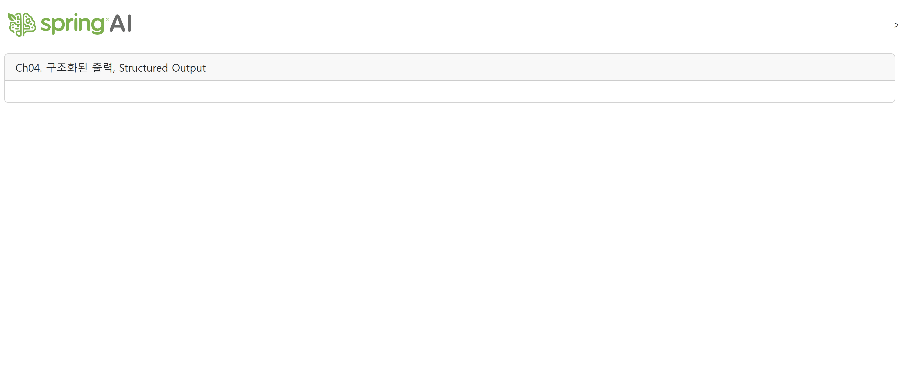
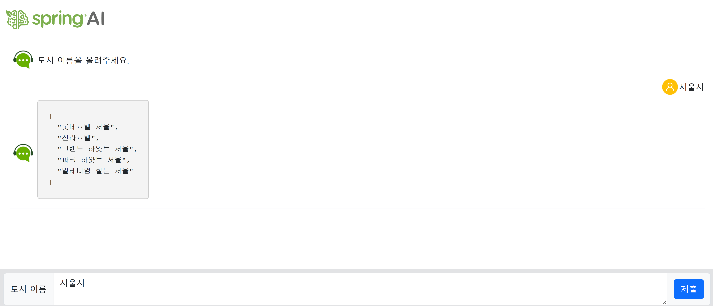
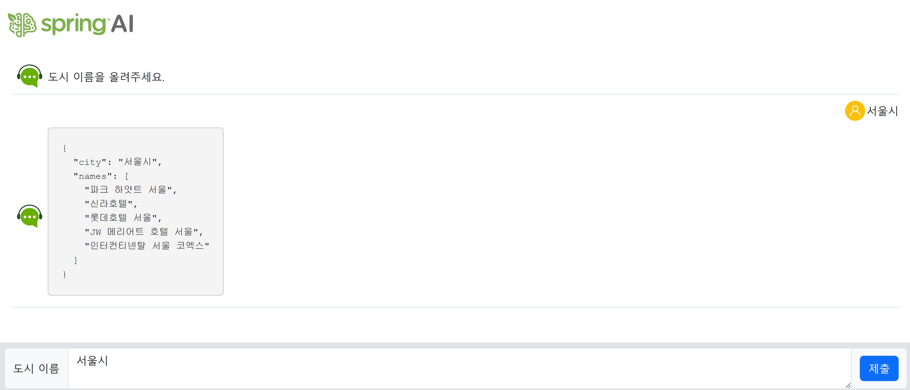

# Getting Started

## 사전 작업 순서 

1. ch03-prompt 프로젝트를 복사하여 ch04-structured-output로 붙여넣는다.

2. src/main/resources/applications.properties 파일을 아래와 같이 수정합니다 
```
#spring.application.name=ch03-prompt
spring.application.name=ch04-structured-output

...

```

3. settings.gradle 아래와 같이 수정합니다 
```
rootProject.name = 'ch04-structured-output'
```

4. src의 controller 폴더에 Ai로 시작하는 Controller java 파일을 모두 삭제합니다

5. src의 service 폴더에 Ai로 시작하는 Service java 파일을 모두 삭제합니다

6. resources/templates 폴더에 home.html 파일을 제외하고 모두 삭제합니다

7. resources/templates/home.html 파일은 아래와 같이 수정합니다 
```
<!DOCTYPE html>
<html>

<head>
  <meta charset="UTF-8" />
  <meta name="viewport" content="width=device-width, initial-scale=1.0" />
  <title>Spring AI</title>
  <link href="https://cdn.jsdelivr.net/npm/bootstrap@5.3.5/dist/css/bootstrap.min.css" rel="stylesheet" />
  <script src="https://cdn.jsdelivr.net/npm/bootstrap@5.3.5/dist/js/bootstrap.bundle.min.js"></script>
</head>

<body>
	<div class="d-flex flex-column vh-100">
	  <div id="headPanel" class="navbar justify-content-between">
	    <a href="/" class="navbar-brand ps-2">
	      
	    </a>>
	  </div>	
	
	  <div class="card m-2">
			<div class="card-header">
				Ch04. 구조화된 출력, Structured Output
			</div>
			<div class="card-body">
			</div>
	  </div>
	</div>
</body>

</html>
```

8. 위 작업이 완료된 것은 git 이력은 [4장 작업을 시작하기 위해 초기설정]을 checkout하여 작업은 진행하시면 됩니다 

9. 실행 하여 테스트 해봅니다 

    브라우저 주소창에 http://localhost:8080/을 실행하면 아래 그림과 같이 출력됩니다 

	

---

## 4.1 구조화된 출력 변환기 

### 1. 구조화된 출력 변환기(Structured Output Converter)란 무엇인가요?

간단히 말해, AI 모델이 생성한 평범한 텍스트(String) 응답을 개발자가 원하는 특정 자바 객체(Java Object, POJO) 형태로 자동 변환해주는 도구입니다.

AI는 기본적으로 사람처럼 자연어 텍스트로 대답합니다. 하지만 우리 개발자들은 애플리케이션에서 데이터를 다루기 위해 텍스트 덩어리보다는 다음과 같은 구조화된 객체를 더 선호합니다.

* User 클래스 객체
* List<String> 형태의 목록
* Map<String, Object> 형태의 키-값 데이터

출력 변환기는 바로 이 'AI의 텍스트'와 '개발자의 자바 객체' 사이를 이어주는 똑똑한 번역기 역할을 합니다.

---

### 2. 왜 만들었을까요?

이 기능이 없던 시절을 상상해 보면 그 이유를 쉽게 알 수 있습니다.

문제 상황 : 출력 변환기가 없다면?

AI에게 영화 정보를 물어본다고 가정해 봅시다.

나의 질문: "영화 '인셉션'의 감독과 주인공은 누구인가요?"

AI의 텍스트 응답 (String):

1 "영화 '인셉션'의 감독은 크리스토퍼 놀란이고, 주연 배우는 레오나르도 디카프리오입니다."

이 응답에서 감독과 배우 정보를 추출하려면 개발자는 다음과 같은 매우 번거롭고 불안정한 작업을 해야 합니다.

	1. String 응답에서 "감독은" 이라는 키워드를 찾는다.
	
	2. 그 뒤에 나오는 이름 "크리스토퍼 놀란"을 파싱해서 추출한다.

	3. "주연 배우는" 이라는 키워드를 찾는다.

	4. 그 뒤에 나오는 이름 "레오나르도 디카프리오"를 파싱해서 추출한다.

이 방식은 AI의 응답 형식이 조금만 바뀌어도(예: "주인공은 레오나르도 디카프리오, 감독은 크리스토퍼 놀란입니다.") 코드가 쉽게 깨지는 큰 단점이 있습니다.

---

### 3. StructuredOutputConverter<T> 인터페이스란?

	StructuredOutputConverter<T>는 Spring AI에서 AI의 텍스트 응답을 특정 자바 객체 `T`로 변환하는 모든 클래스가 반드시 따라야 하는 규칙(contract)을 정의한 최상위 인터페이스입니다.

  	'인터페이스'이므로 실제 변환 로직을 담고 있지는 않습니다. 대신 "구조화된 출력 변환을 하려면, 최소한 이런 기능들은 반드시 구현해야 해!"라고 명시하는 역할을 합니다.

  	제네릭 타입 <T>의 의미

  	여기서 <T>는 제네릭(Generic) 타입으로, "이 변환기가 최종적으로 어떤 타입의 자바 객체를 반환할 것인가"를 의미하는 플레이스홀더입니다.

   * BeanOutputConverter<Movie>를 만든다면, T는 Movie 클래스가 됩니다.
   * ListOutputConverter는 내부적으로 StructuredOutputConverter<List<String>>을 구현하므로, T는 List<String>이 됩니다.

  	이 제네릭 덕분에 우리는 컴파일 시점에 변환기가 반환할 객체의 타입을 명확히 알 수 있고, 타입 안정성(type safety)을 확보할 수 있습니다.

### 4. 핵심 추상 메소드 (반드시 구현해야 하는 기능)

StructuredOutputConverter<T> 인터페이스는 두 가지 핵심적인 추상 메소드를 정의합니다. 이 인터페이스를 구현하는 모든 클래스(예: BeanOutputConverter)는 이 두 메소드의 실제 동작을 반드시 코드로 작성해야 합니다.

  1) T parse(String text)

   * 역할: AI로부터 받은 텍스트 응답(`String`)을 최종 목표 객체 `T`로 파싱(변환)하는 가장 중요한 메소드입니다.
   * 동작:
       * 입력: AI가 응답한 순수 텍스트(예: JSON 형식의 문자열)를 text 파라미터로 받습니다.
       * 처리: 내부적으로 Jackson과 같은 라이브러리를 사용하여 이 텍스트를 분석하고, 제네릭 타입 T에 해당하는 자바 객체의 인스턴스를 생성합니다.
       * 출력: 완전히 변환된 자바 객체(타입 T)를 반환합니다.
   * 예시: BeanOutputConverter<Movie>의 parse 메소드 내부에는 new ObjectMapper().readValue(text, Movie.class)와 유사한 코드가 들어있습니다.

  2) String getFormat()
   * 역할: AI에게 어떤 형식으로 응답을 만들어야 하는지 알려주는 '지시사항' 문자열을 생성하는 메소드입니다.
   * 동작:
       * 처리: 제네릭 타입 T의 구조(클래스의 필드, 타입 등)를 분석하여, AI가 이해할 수 있는 명확한 출력 형식(주로 JSON 스키마)을 문자열로 만듭니다.
       * 출력: "너의 답변은 반드시 이 JSON 스키마를 따라야 해..." 와 같은 지시사항 String을 반환합니다.
   * 예시: BeanOutputConverter<Movie>의 getFormat 메소드는 Movie 레코드의 구조를 보고 아래와 같은 JSON 스키마 설명 문자열을 생성하여 반환합니다.

```java
	{
	"title": "string",
	"plot": "string",
	"actors": ["string"]
	}
```
이 String은 Spring AI 프레임워크에 의해 자동으로 사용자 프롬프트 뒤에 추가됩니다.

### 5. StructuredOutputConverter<T>와 구현 클래스의 관계

  이들의 관계를 설계도와 건물에 비유할 수 있습니다.

   * `StructuredOutputConverter<T>` (인터페이스): "모든 건물은 문과 창문이 있어야 한다"는 최상위 설계도.
   * `AbstractConversionServiceOutputConverter<T>` (추상 클래스): 문과 창문의 기본 뼈대를 미리 만들어 둔 중간 설계도.
   * `BeanOutputConverter<T>` (구체 클래스): 위 설계도를 바탕으로, 아파트(Bean)라는 특정 목적에 맞게 문과 창문을 실제로 시공한 완성된 건물. getFormat은 자바 리플렉션을 사용해 클래스 구조를 분석하고, parse는 Jackson을 사용해 JSON을 파싱하는 방식으로 구체화합니다.
   * `ListOutputConverter` (구체 클래스): 위 설계도를 바탕으로, 상가(List)라는 목적에 맞게 구현한 완성된 건물. getFormat은 쉼표로 구분된 리스트를 만들라고 지시하고, parse는 문자열을 쉼표로 쪼개는 방식으로 구체화합니다.

6. 애플리케이션에서 이들 구현제를 사용하는 방법을 알아봅시다.
	|구분|설명|
	|---|---|
	|저수준|변환기를 직접 생성해서 형식 지침을 제공하고, 변환하는 방법|
	|고수준|ChatClient의 메소드 체이밍 맨 마지막에 entiry()메소드를 호출하는 방법 

 
7. 고수준 출력 변환기 

	개발자들은 지저분한 문자열 파싱 대신, 처음부터 AI가 다음과 같은 MovieInfo 객체를 만들어서 리턴해 원했습니다.

```java
   public record MovieInfo(String director, String actor) {}
```

	'구조화된 출력 변환기'는 바로 이 문제를 해결하기 위해 탄생했습니다. 개발자가 직접 문자열을 파싱하는 코드를 한 줄도 작성하지 않고, AI의 응답을 원하는 자바 객체로 바로 받을 수 있게 해주는 것이 핵심 목표입니다.

8. 어떻게 사용하나요? (핵심 예제)

	가장 많이 사용되는 BeanOutputConverter를 예제로 단계별로 설명하겠습니다.

	목표: 영화 제목을 물어보면, 그 영화의 줄거리와 주연 배우 목록을 담은 Movie 객체를 AI로부터 바로 받아오기

	1단계: 결과를 담을 자바 객체(Record) 정의

	먼저 AI의 답변을 담을 '틀'을 만듭니다. Java의 record를 사용하면 매우 간결하게 정의할 수 있습니다.
```java
package com.example.demo.dto;

import java.util.List;

public record Movie(
    String title,       // 영화 제목
    String plot,        // 줄거리
    List<String> actors // 주연 배우 목록
) {}
```

	2단계: 서비스 클래스에서 출력 변환기 사용

	이제 AI 서비스를 호출하는 부분에서 출력 변환기를 사용합니다.

```java
package com.example.demo.service;

import com.example.demo.dto.Movie;
import org.springframework.ai.chat.client.ChatClient;
import org.springframework.ai.converter.BeanOutputConverter;
import org.springframework.stereotype.Service;

@Service
public class AiMovieService {
    private final ChatClient chatClient;

    public AiMovieService(ChatClient.Builder chatClientBuilder) {
        this.chatClient = chatClientBuilder.build();
    }

    public Movie getMovieInfo(String movieTitle) {
        // 1. 출력 변환기 생성: 결과를 어떤 클래스(Movie.class)로 변환할지 알려줍니다.
        var outputConverter = new BeanOutputConverter<>(Movie.class);

        // 2. 사용자 프롬프트 작성: AI에게 무엇을 원하는지 간단히 요청합니다.
        //    "JSON으로 만들어줘" 같은 복잡한 지시를 할 필요가 없습니다!
        String userPrompt = """
            영화 '%s'의 줄거리와 주요 배우 목록을 알려주세요.
            """.formatted(movieTitle);

        // 3. ChatClient 호출 시, 출력 변환기를 함께 전달합니다.
        return chatClient.prompt()
                .user(userPrompt)
                // 이 부분이 핵심! 변환기가 응답을 Movie 객체로 바꿔줍니다.
                .call()
                .entity(outputConverter);
    }
}
```

	4단계: 내부 동작 원리

	entity(outputConverter)를 호출하면 Spring AI가 내부적으로 두 가지 중요한 일을 자동으로 처리합니다.

	4.1 프롬프트 자동 보강:
    
	개발자가 작성한 간단한 프롬프트(userPrompt)에 AI가 이해할 수 있는 출력 형식 정보를 덧붙입니다. outputConverter는 Movie 클래스 구조를 보고 다음과 같은 지시사항을 만들어 프롬프트 뒤에 추가합니다.
```
      > (개발자 프롬프트...)
      >
      > Your response should be in a JSON format. Do not include any explanations, only provide a RFC8259 compliant JSON response following this format without deviation.
      > The JSON schema is:
      > `json
      > {
      >  "title": "string",
      >  "plot": "string",
      >  "actors": ["string"]
      > }
      > `
```

	그 텍스트는 Spring AI의 OutputConverter가 AI 모델에게 "너의 답변을 내가 원하는 특정 JSON 구조로 정확하게 만들어줘!" 라고 지시하는 매우 명확하고 엄격한 명령어 세트입니다.

	이것은 AI와 애플리케이션 사이에 맺는 일종의 '엄격한 계약서'라고 생각하시면 됩니다. 각 문장이 어떤 의미와 목적을 가지는지 하나씩 상세히 알아 보겠습니다.

  ---

### 명령어 세트 상세 분석

1. Your response should be in a JSON format.

   * 의미: "너의 응답은 JSON 형식이어야 한다."
   * 목적: 가장 기본적인 지시입니다. AI에게 앞으로 만들 답변의 기본 포맷이 JSON임을 명확히 알려줍니다.

2. Do not include any explanations, only provide a RFC8259 compliant JSON response following this format without deviation.

   이 문장은 여러 개의 중요한 지시가 합쳐져 있으며, 전체 명령어 세트에서 가장 핵심적인 부분입니다.

   * `Do not include any explanations...`
      * 의미: "JSON 데이터 외에 그 어떤 부가적인 설명도 절대 붙이지 마라."
      * 목적: LLM은 기본적으로 친절한 '대화형' 모델이라, 종종 "물론이죠! 요청하신 JSON입니다:" 와 같은 군더더기 텍스트를 JSON 앞뒤에 붙이는 경향이 있습니다. 이런 텍스트가 포함되면 프로그램의 JSON 파서(Parser)는 오류를 일으킵니다. 이 지시는 그러한 오류를 원천 차단하기 위한 매우 중요한 장치입니다.

   * `...only provide a ... JSON response...`
      * 의미: "오직 JSON 응답만 제공해라."
      * 목적: 바로 앞의 지시를 다시 한번 강조하여, 응답 전체가 순수한 JSON 데이터여야 함을 못 박는 역할을 합니다.

   * `...a RFC8259 compliant JSON response...`
       * 의미: "표준 JSON(RFC 8259) 규격을 완벽하게 따르는 JSON을 제공해라."
       * 목적: 'RFC 8259'는 JSON 데이터 형식의 공식 기술 표준 문서입니다. 이 지시는 AI에게 "대충 비슷하게 생긴 JSON 말고, 표준 규칙을 모두 지킨 '품질 높은' JSON을 만들어라"고 요구하는 것입니다. 예를 들어, 다음과 같은 미묘한 오류들을 방지합니다.
           * 키(key)를 쌍따옴표(")로 감싸지 않는 실수
           * 문자열을 홑따옴표(')로 감싸는 실수
           * 배열이나 객체 마지막에 쉼표(trailing comma)를 붙이는 실수

   * `...following this format without deviation.`
       * 의미: "내가 아래에 보여줄 형식을 조금도 벗어나지 말고 그대로 따라 해라."
       * 목적: AI가 창의성(?)을 발휘하여 임의로 필드를 추가하거나 빼는 것을 막습니다. 예를 들어, actors 필드를 main_actors 라고 마음대로 바꾸거나, summary 라는 필드를 임의로 추가하는 등의 행동을 금지시켜, 약속된 구조를 정확히 지키도록 강제합니다.

3. The JSON schema is:
* 의미: "이제부터 그 형식이 어떻게 생겼는지 보여줄게."
* 목적: 이어지는 내용이 바로 AI가 따라야 할 JSON의 구조(Schema)임을 알려주는, 일종의 소제목 역할을 합니다.

4. json { "title": "string", "plot": "string", "actors": ["string"] }
* 의미: "이것이 바로 네가 따라야 할 JSON의 구조(스키마)다."
* 목적: AI에게 만들어야 할 JSON의 구체적인 모양을 명확하게 보여줍니다.
	* "title": "string": title이라는 이름의 키가 반드시 있어야 하고, 그 값은 문자열(string) 타입이어야 한다.
	* "plot": "string": plot이라는 이름의 키가 반드시 있어야 하고, 그 값은 문자열(string) 타입이어야 한다.
	* "actors": ["string"]: actors라는 이름의 키가 반드시 있어야 하고, 그 값은 여러 문자열들로 이루어진 배열(array) 타입이어야 한다.

---

### 왜 이렇게까지 엄격하게 지시할까요?

가장 큰 이유는 기계적인 안정성(Machine-level Reliability)을 확보하기 위함입니다. 사람 간의 대화는 문맥에 따라 유연하게 해석될 수 있지만, 프로그램이 데이터를 처리할 때는 단 하나의 오차도 허용되지 않습니다. 이 명령어 세트는 자유롭고 창의적인 언어 모델(LLM)을 마치 잘 정의된 API 엔드포인트처럼 예측 가능하고 신뢰할 수 있는 형태로 동작하도록 '길들이는' 과정입니다.

결과적으로 이 엄격한 '계약서' 덕분에 개발자는 AI를 단순한 '대화 상대'가 아닌, 내 애플리케이션의 일부로 통합할 수 있는 '신뢰할 수 있는 데이터 생성기'로 활용할 수 있게 됩니다.

---

4.2 응답 자동 파싱:
      
   AI는 위 보강된 프롬프트를 보고 다음과 같은 JSON 형식의 텍스트를 응답으로 보냅니다.
```json
{
    "title": "인셉션",
    "plot": "타인의 꿈에 들어가 생각을 훔치는 특수 요원들의 이야기입니다.",
    "actors": ["레오나르도 디카프리오", "조셉 고든 레빗", "엘렌 페이지"]
}
```   
   그러면 outputConverter가 이 JSON 문자열을 Jackson 같은 라이브러리를 사용해서 우리가 원했던 Movie 자바 객체로 자동으로 변환하여 최종 반환합니다.

   결과적으로 개발자는 프롬프트에 복잡한 출력 형식을 지시할 필요도, 응답받은 JSON을 파싱할 필요도 없이 깔끔하게 Movie 객체를 얻게 됩니다.

---

  4. 주요 출력 변환기 종류

   * `BeanOutputConverter`: 가장 많이 사용되며, 사용자가 정의한 특정 자바 클래스(POJO 또는
     Record)로 변환합니다. (위 예제)
   * `ListOutputConverter`: 쉼표로 구분된 문자열 목록을 List<String>으로 변환합니다.
```java
// AI 응답: "사과, 바나나, 오렌지"  ->  List.of("사과", "바나나", "오렌지")
var listConverter = new ListOutputConverter(new DefaultConversionService());
```
   * `MapOutputConverter`: JSON 형식의 키-값 쌍을 Map<String, Object>로 변환합니다.
```java
// AI 응답: {"이름": "홍길동", "나이": 30} -> Map.of("이름", "홍길동", "나이", 30)
var mapConverter = new MapOutputConverter();
```

구조화된 출력 변환기는 AI의 비구조적인 텍스트 응답과 애플리케이션의 구조적인 데이터 모델
사이의 간극을 메워주는 Spring AI의 필수적인 도구입니다. 이를 통해 개발자는 지저분한 문자열
처리 로직에서 해방되어, 더 깔끔하고 안정적이며 유지보수하기 쉬운 코드를 작성하는 데 집중할 수 있습니다. StructuredOutputConverter<T>는 단순히 "변환기"가 아니라, Spring AI의 확장성의 핵심입니다. 이 인터페이스의 규칙만 따른다면, 개발자는 JSON뿐만 아니라 XML, YAML, 또는 특정 형식의 텍스트를 파싱하는 자신만의 커스텀 변환기를 얼마든지 만들어 Spring AI 생태계에 통합할 수 있습니다. 이는 '무엇을 할 것인가(변환)'와 '어떻게 할 것인가(구체적인 파싱 방법)'를 분리하는 객체 지향의 좋은 설계 원칙을 보여주는 훌륭한 예입니다.

### 4.2 List<String>으로 변환(ListOutputConverter)

LLM의 출력을 List<String>변환하고 싶다면, ListOutputConverter를 사용할 수 있습니다. 이 변환기는 LLM이 쉼표로 구분된 텍스트 출력을 할 수 있도록 지침을 생성하고, LLM의 출력을 List<String>으로 변환합니다.

service/AiMovieService.java 
```java
/**
 * AI의 응답을 List<String> 형태로 변환하는 ListOutputConverter의 사용법을 보여주는 서비스 클래스입니다.
 * 동일한 목표를 고수준(High-Level) API와 저수준(Low-Level) API 두 가지 방식으로 구현하여 차이점을 비교합니다.
 */
@Service
@Slf4j
public class AiServiceListOutputConverter {
  // ##### 필드 #####
  private ChatClient chatClient; // AI 모델과 상호작용하기 위한 클라이언트

  // ##### 생성자 #####
  public AiServiceListOutputConverter(ChatClient.Builder chatClientBuilder) {
    this.chatClient = chatClientBuilder.build();
  }

  // ##### 메소드 #####

  /**
   * 저수준(Low-Level) API를 사용하여 AI의 응답을 List<String>으로 변환합니다.
   * 개발자가 변환의 모든 단계를 직접 제어하며, 디버깅이나 복잡한 프롬프트 구성에 유리합니다.
   *
   * @param city 도시 이름
   * @return 해당 도시의 호텔 목록
   */
  public List<String> listOutputConverterLowLevel(String city) {
    // 1. ListOutputConverter를 생성합니다. AI 응답(쉼표로 구분된 문자열)을 List<String>으로 변환하는 역할을 합니다.
    ListOutputConverter converter = new ListOutputConverter();

    // 2. 프롬프트 템플릿에 출력 형식을 지정하는 {format} 플레이스홀더를 직접 포함시킵니다.
    PromptTemplate promptTemplate = PromptTemplate.builder()
        .template("{city}에서 유명한 호텔 목록 5개를 출력하세요. {format}")
        .build();

    // 3. converter.getFormat()을 호출하여 AI에게 전달할 형식 정보를 가져와, 프롬프트를 최종 완성합니다.
    Prompt prompt = promptTemplate.create(
        Map.of("city", city, "format", converter.getFormat()));

    // 4. AI를 호출하여 순수한 텍스트(쉼표로 구분된 문자열) 응답을 받습니다.
    String commaSeparatedString = chatClient.prompt(prompt)
        .call()
        .content();
    log.info("AI 원본 응답: {}", commaSeparatedString);

    // 5. 변환기의 convert() 메소드를 직접 호출하여, 응답 문자열을 List<String>으로 변환합니다.
    List<String> hotelList = converter.convert(commaSeparatedString);
    return hotelList;
  }
  
  /**
   * 고수준(High-Level) API를 사용하여 AI의 응답을 List<String>으로 변환합니다.
   * 코드가 매우 간결하며, 대부분의 일반적인 경우에 권장되는 방식입니다.
   *
   * @param city 도시 이름
   * @return 해당 도시의 호텔 목록
   */
  public List<String> listOutputConverterHighLevel(String city) {
    // .entity() 메소드에 ListOutputConverter 인스턴스를 전달하는 것만으로,
    // 저수준 API의 1~5번 과정(프롬프트 보강, AI 호출, 응답 파싱)이 모두 자동으로 처리됩니다.
    List<String> hotelList = chatClient.prompt()
        .user("%s에서 유명한 호텔 목록 5개를 출력하세요.".formatted(city))
        .call()
        .entity(new ListOutputConverter());
    return hotelList;
  }
}

```

controller/AiControllerListOutputConverter.java
```java
/**
 * AiServiceListOutputConverter 서비스를 호출하고, 그 결과를 API 엔드포인트를 통해
 * 외부에 제공하는 컨트롤러 클래스입니다.
 */
@RestController
@RequestMapping("/ai")
@Slf4j
public class AiControllerListOutputConverter {
  // ##### 필드 #####
  @Autowired
  private AiServiceListOutputConverter aiService; // ListOutputConverter 로직을 처리하는 서비스
  
  // ##### 메소드 #####
  /**
   * '/ai/list-output-converter' 경로로 들어오는 POST 요청을 처리합니다.
   * 도시 이름을 받아 해당 도시의 호텔 목록을 AI로부터 추천받아 JSON 배열 형태로 반환합니다.
   *
   * @param city 'city'라는 이름의 요청 파라미터 (사용자가 입력한 도시 이름)
   * @return 호텔 이름 목록 (List<String>). Spring MVC에 의해 JSON 배열로 자동 변환되어 응답됩니다.
   */
  @PostMapping(
    value = "/list-output-converter",
    consumes = MediaType.APPLICATION_FORM_URLENCODED_VALUE, // 이 엔드포인트는 form-urlencoded 형식의 데이터를 소비합니다.
    produces = MediaType.APPLICATION_JSON_VALUE   // 이 엔드포인트는 JSON 형식의 데이터를 생성합니다.
  )
  public List<String> listOutputConverter(@RequestParam("city") String city) {
    // 서비스의 저수준 또는 고수준 API 메소드를 선택하여 호출할 수 있습니다.
    // 아래 두 줄 중 하나를 선택하고 다른 하나를 주석 처리하여 테스트하려는 방식을 쉽게 전환할 수 있습니다.
    List<String> hotelList = aiService.listOutputConverterLowLevel(city);
    // List<String> hotelList = aiService.listOutputConverterHighLevel(city);
    return hotelList;
  }
}
```

### 브라우저에서 실행 하여 테스트 해보기
http://localhost:8080/list-output-converter 을 실행하고 제출을 클릭하면 아래 그림과 같이 출력됩니다 




### 저수준에서 고수준으로 변환하고 실행을 해보세요 
controller/AiControllerListOutputConverter.java
```java
...
public class AiControllerListOutputConverter {
  ...
  public List<String> listOutputConverter(@RequestParam("city") String city) {
    // 서비스의 저수준 또는 고수준 API 메소드를 선택하여 호출할 수 있습니다.
    // 아래 두 줄 중 하나를 선택하고 다른 하나를 주석 처리하여 테스트하려는 방식을 쉽게 전환할 수 있습니다.
    //List<String> hotelList = aiService.listOutputConverterLowLevel(city);

	//고수준 호출로 변경합니다 
    List<String> hotelList = aiService.listOutputConverterHighLevel(city);
    return hotelList;
  }
}
```
실행 결과 


## 4.3 T로 변환(BeanOutputConverter)

LLM의 출력을 T 객체로 변화하고 싶다면, BeanOutputConverter를 사용할 수 있습니다. T는 변환할 자바 타입입니다. 이 변환기는 LLM이 JSON 출력을 할 수 있도록 지침을 생성하고, LLM의 출력을 T 객체로 변환합니다.

dto/Hotel.java
```java
@Data
public class Hotel {
  // 도시 이름
  private String city;
  // 호텔 이름 목록
  private List<String> names;
}
```

service/AiServiceBeanOutputConverter.java
```java
/**
 * AI의 응답을 특정 자바 객체(POJO)로 변환하는 BeanOutputConverter의 사용법을 보여주는 서비스 클래스입니다.
 * 동일한 목표를 고수준(High-Level) API와 저수준(Low-Level) API 두 가지 방식으로 구현하여 비교합니다.
 */
@Service
@Slf4j
public class AiServiceBeanOutputConverter {
  // ##### 필드 #####
  private ChatClient chatClient; // AI 모델과 상호작용하기 위한 클라이언트

  // ##### 생성자 #####
  public AiServiceBeanOutputConverter(ChatClient.Builder chatClientBuilder) {
    this.chatClient = chatClientBuilder.build();
  }

  // ##### 메소드 #####

  /**
   * 저수준(Low-Level) API를 사용하여 AI의 응답을 'Hotel' 객체로 변환합니다.
   * 개발자가 변환의 모든 단계를 직접 제어하며, 디버깅이나 복잡한 프롬프트 구성에 유리합니다.
   *
   * @param city 도시 이름
   * @return AI가 생성한 정보를 담은 Hotel 객체
   */
  public Hotel beanOutputConverterLowLevel(String city) {
    // 1. BeanOutputConverter를 생성하며, 변환할 대상 클래스(Hotel.class)를 명시합니다.
    BeanOutputConverter<Hotel> beanOutputConverter = new BeanOutputConverter<>(Hotel.class);

    // 2. 프롬프트 템플릿에 출력 형식을 지정하는 {format} 플레이스홀더를 직접 포함시킵니다.
    PromptTemplate promptTemplate = PromptTemplate.builder()
        .template("{city}에서 유명한 호텔 한 곳을 추천해 주세요. {format}")
        .build();

    // 3. converter.getFormat()을 호출하여 Hotel 클래스 구조에 맞는 JSON 스키마 정보를 가져와 프롬프트를 완성합니다.
    Prompt prompt = promptTemplate.create(Map.of(
        "city", city,
        "format", beanOutputConverter.getFormat()));

    // 4. AI를 호출하여 순수한 JSON 텍스트 응답을 받습니다.
    String json = chatClient.prompt(prompt)
        .call()
        .content();
    log.info("AI 원본 응답 (JSON): {}", json);

    // 5. 변환기의 convert() 메소드를 직접 호출하여, 응답 JSON을 Hotel 객체로 변환합니다.
    Hotel hotel = beanOutputConverter.convert(json);
    return hotel;
  }
  
  /**
   * 고수준(High-Level) API를 사용하여 AI의 응답을 'Hotel' 객체로 변환합니다.
   * 코드가 매우 간결하며, 자바 객체로 변환하는 대부분의 경우에 권장되는 방식입니다.
   *
   * @param city 도시 이름
   * @return AI가 생성한 정보를 담은 Hotel 객체
   */
  public Hotel beanOutputConverterHighLevel(String city) {
    // .entity() 메소드에 변환할 클래스(Hotel.class)를 직접 전달합니다.
    // 이렇게 하면 Spring AI가 내부적으로 BeanOutputConverter<Hotel>를 생성하고,
    // 저수준 API의 1~5번 과정을 모두 자동으로 처리해 줍니다.
    Hotel hotel = chatClient.prompt()
        .user("%s에서 유명한 호텔 한 곳을 추천해 주세요.".formatted(city))
        .call()
        .entity(Hotel.class);
    return hotel;
  }
}
```

controller/AiControllerBeanOutputConverter.java
```java
/**
 * AiServiceBeanOutputConverter 서비스를 호출하고, 그 결과를 API 엔드포인트를 통해
 * 외부에 제공하는 컨트롤러 클래스입니다.
 */
@RestController
@RequestMapping("/ai")
@Slf4j
public class AiControllerBeanOutputConverter {
  // ##### 필드 #####
  @Autowired
  private AiServiceBeanOutputConverter aiService; // BeanOutputConverter 로직을 처리하는 서비스
  
  // ##### 메소드 #####
  /**
   * '/ai/bean-output-converter' 경로로 들어오는 POST 요청을 처리합니다.
   * 도시 이름을 받아 해당 도시의 호텔 정보를 AI로부터 추천받아 Hotel 객체 형태로 반환합니다.
   *
   * @param city 'city'라는 이름의 요청 파라미터 (사용자가 입력한 도시 이름)
   * @return 추천 호텔 정보를 담은 Hotel 객체. Spring MVC에 의해 JSON 객체로 자동 변환되어 응답됩니다.
   */
  @PostMapping(
    value = "/bean-output-converter",
    consumes = MediaType.APPLICATION_FORM_URLENCODED_VALUE, // 이 엔드포인트는 form-urlencoded 형식의 데이터를 소비합니다.
    produces = MediaType.APPLICATION_JSON_VALUE   // 이 엔드포인트는 JSON 형식의 데이터를 생성합니다.
  )
  public Hotel beanOutputConverter(@RequestParam("city") String city) {
    // 서비스의 저수준 또는 고수준 API 메소드를 선택하여 호출할 수 있습니다.
    // 아래 두 줄 중 하나를 선택하고 다른 하나를 주석 처리하여 테스트하려는 방식을 쉽게 전환할 수 있습니다.
    Hotel hotel = aiService.beanOutputConverterLowLevel(city);
    //Hotel hotel = aiService.beanOutputConverterHighLevel(city);
    return hotel;
  }
}
```

### 브라우저에서 실행 하여 테스트 해보기
http://localhost:8080/bean-output-converter 을 실행하고 제출을 클릭하면 아래 그림과 같이 출력됩니다 



### 저수준에서 고수준으로 변환하고 실행을 해보세요 
controller/AiControllerListOutputConverter.java
```java
...
public class AiControllerBeanOutputConverter {
...
  public Hotel beanOutputConverter(@RequestParam("city") String city) {
    // 서비스의 저수준 또는 고수준 API 메소드를 선택하여 호출할 수 있습니다.
    // 아래 두 줄 중 하나를 선택하고 다른 하나를 주석 처리하여 테스트하려는 방식을 쉽게 전환할 수 있습니다.
    //Hotel hotel = aiService.beanOutputConverterLowLevel(city);

	//고수준 호출로 변경합니다 
    Hotel hotel = aiService.beanOutputConverterHighLevel(city);
    return hotel;
  }
}
```
실행 결과 

